# 智慧工地大模型应用系统——系统设计文档

> - 文档版本：v1.0
> - 基线日期：2026-07-23
> - 文档状态：现行设计基线
> - 架构形态：模块化单体 Java 主系统 + Vue Web 前端 + Python 智能算法服务
> - 适用对象：产品、架构、后端、前端、算法、测试、运维、安全与项目管理人员

<details>
<summary>章节导航</summary>

1. [文档控制](#0-文档控制)
2. [系统概述](#1-系统概述)
3. [架构原则、约束与关键决策](#2-架构原则约束与关键决策)
4. [总体架构](#3-总体架构)
5. [Java 后端分层与模块设计](#4-java-后端分层与模块设计)
6. [前端系统设计](#5-前端系统设计)
7. [Python 智能算法服务设计](#6-python-智能算法服务设计)
8. [核心业务流程设计](#7-核心业务流程设计)
9. [异步任务与可靠性设计](#8-异步任务与可靠性设计)
10. [数据设计](#9-数据设计)
11. [接口设计](#10-接口设计)
12. [安全设计](#11-安全设计)
13. [可观测性、异常与审计设计](#12-可观测性异常与审计设计)
14. [部署与运行设计](#13-部署与运行设计)
15. [性能、容量与可用性设计](#14-性能容量与可用性设计)
16. [测试与质量保证](#15-测试与质量保证)
17. [现状差距、风险与演进路线](#16-现状差距风险与演进路线)
18. [验收与运维检查清单](#17-验收与运维检查清单)
19. [术语、枚举与参考文档](#18-术语枚举与参考文档)

</details>

---

## 0. 文档控制

> **本章总结：** 本文档是在完整阅读仓库全部项目自有 Markdown 文档，并进一步核对 Java、Vue、Python、Flyway、Docker Compose 与运行配置后形成的系统级设计基线。它不是单纯复述需求，也不把规划能力伪装成已实现能力，而是同时描述系统目标、当前实现、强制架构约束、关键业务流程、数据与接口设计、可靠性机制、部署方式及演进路线。若本文档与早期目标文档存在差异，应先区分“现行代码事实”和“目标设计”；当前接口事实以 Controller、迁移和模块 API 文档为准，长期边界以根 `AGENTS.md` 的强制约束为准。

### 0.1 文档目的

本文档用于统一回答以下问题：

1. 系统解决什么业务问题，覆盖哪些用户和业务能力。
2. Vue 前端、Java 后端、Python 智能服务、MySQL、Redis、MinIO、向量存储分别承担什么责任。
3. Java 模块如何分层，模块之间如何协作，哪些跨层或跨模块调用被禁止。
4. 问答、文档解析、知识入库、合规审查、报告生成、OCR、政策采集如何端到端执行。
5. 长任务如何借助任务表、Outbox、Redis、Worker、租约、心跳、重试和协作取消保证可追踪性。
6. 33 张现行数据表如何分域，关键状态与关系如何定义。
7. 身份认证、RBAC、项目隔离、数据源安全、文件访问和敏感信息保护如何实现。
8. 当前实现与目标架构之间还存在哪些偏差，以及应如何收敛。

### 0.2 信息来源与事实优先级

本文档采用以下事实优先级：

| 优先级 | 来源 | 用法 |
| --- | --- | --- |
| 1 | 用户当前明确要求、根 `AGENTS.md`、模块 `AGENTS.md` | 强制边界、开发约束和验收契约 |
| 2 | 当前 Controller、Application Service、Domain、Repository、Mapper、Infra 代码 | 判断现行实现 |
| 3 | Flyway `V1`—`V19` 迁移、`application.yml`、`pom.xml`、前端路由、Python 路由 | 判断数据、配置、技术栈和运行事实 |
| 4 | 各模块 `API.md`、根 `README.md` | 判断公开契约和联调说明 |
| 5 | 需求文档、早期架构文档 | 判断目标范围和规划能力 |

### 0.3 范围说明

系统范围包括：

- 项目、用户、角色、权限、项目成员与项目设置。
- 文件对象、文档解析、模板、变量和规则。
- 项目知识库、文档入库、RAG 检索、政策资讯采集。
- 模型问答、知识库问答、数据库问答、混合路由和反馈。
- 长文档合规审查、规则快照、证据、问题和整改状态。
- 知识库驱动的报告变量生成、DOCX 渲染、版本和下载。
- 身份证、车牌、发票、自定义字段 OCR。
- 异步任务、Outbox、Redis 队列、Worker、阶段日志。
- 操作审计、外部调用日志、运行信息和依赖健康。
- Vue Web 管理端和 Python 智能算法服务。

本期不把以下内容描述为已经生产完备：

- SSO、刷新令牌、完整密码策略和批量用户运维。
- 报告 PDF 导出、在线预览、分享、归档和完整版本对比。
- 文件版本、重复检测、清洗任务和完整引用关系管理。
- 生产级告警、访问日志报表、容量治理和灾备自动化。
- 扫描 PDF 的统一分页图像预处理。
- 已部署的 Milvus/pgvector 集群；当前仅有可选适配能力。

### 0.4 文档维护规则

- 公共接口、数据库结构、状态机、模块边界、AI 调用边界或部署拓扑变化时，必须同步更新本文档。
- 已执行的 Flyway 迁移不得修改；数据结构变化只能增加新版本迁移。
- “当前实现”与“目标设计”必须分开描述，禁止通过文档把未实现能力标记为完成。
- 本文档与详细接口文档互补：本文档解释设计，接口文档给出逐接口契约。

---

## 1. 系统概述

> **本章总结：** 智慧工地大模型应用系统不是一个单一聊天机器人，而是一套以工地项目为隔离边界、以文件和知识资产为数据基础、以任务编排为执行骨架、以 AI 服务为智能能力来源的企业应用平台。系统将知识问答、合规审查、报告生成、OCR 和政策资讯等场景统一到一个安全、可追踪、可失败恢复的业务闭环中：前端只面向 Java API，Java 掌握身份、权限、项目、事务、状态、文件和审计，Python 封装模型、Agent、RAG、Embedding、rerank、OCR 与网页内容抽取。

### 1.1 业务背景

建筑工地资料通常分散在 Word、PDF、Excel、图片、业务数据库和互联网政策网站中。传统流程存在以下问题：

- 资料查找依赖个人经验，跨文件检索效率低。
- 规范和模板多，合规审查重复、耗时且难留痕。
- 周报、月报和专项报告内容汇总依赖人工复制。
- 证照、车牌、发票和合同字段录入成本高。
- 多项目并行时容易发生数据串用和权限越界。
- 模型调用如果没有状态、引用、错误和审计，难以用于正式业务。

系统建设重点因此不是“接入一个大模型”，而是建立资料接入、结构化处理、知识检索、模型生成、业务持久化、权限隔离和审计追踪的一体化平台。

### 1.2 建设目标

| 目标 | 设计落实 |
| --- | --- |
| 统一智能应用入口 | 工作台统一进入问答、审查、报告和 OCR |
| 多项目隔离 | 业务表使用 `project_id`，应用服务统一校验项目访问与可写状态 |
| 多源知识接入 | 文件、知识库、政策文章和业务数据源统一由 Java 编排 |
| AI 能力解耦 | Python 服务封装模型、Agent、RAG、Embedding、rerank、OCR |
| 长任务可靠执行 | MySQL 任务与 Outbox 为事实源，Redis 为投递通道，Worker 带租约执行 |
| 结果可追溯 | 保存引用、规则证据、变量值、阶段日志、外部调用日志和 requestId |
| 企业级安全 | JWT、RBAC、项目成员校验、AES-GCM、临时文件 URL、敏感日志脱敏 |
| 可演进 | Java 先采用模块化单体，保持未来拆分服务的领域边界 |

### 1.3 用户与角色

| 用户类型 | 主要职责 | 典型权限 |
| --- | --- | --- |
| 平台管理员 | 用户、角色、权限、全部项目和系统运维 | 全局管理、跨项目查询 |
| 项目管理员 | 管理本项目成员、知识、模板和业务任务 | 本项目管理与业务操作 |
| 业务人员 | 问答、审查、报告、OCR、知识文档维护 | 本项目业务写入 |
| 审核人员 | 查看审查结论、证据和整改状态 | 审查查看与处理 |
| 查看者 | 查看授权项目内结果和统计 | 只读权限 |

现行内置角色代码为：

```text
PLATFORM_ADMIN
PROJECT_ADMIN
BUSINESS_USER
VIEWER
```

这些内置角色属于种子级安全契约，不允许通过角色管理 API 编辑、停用、删除或重分配权限。

### 1.4 核心能力地图

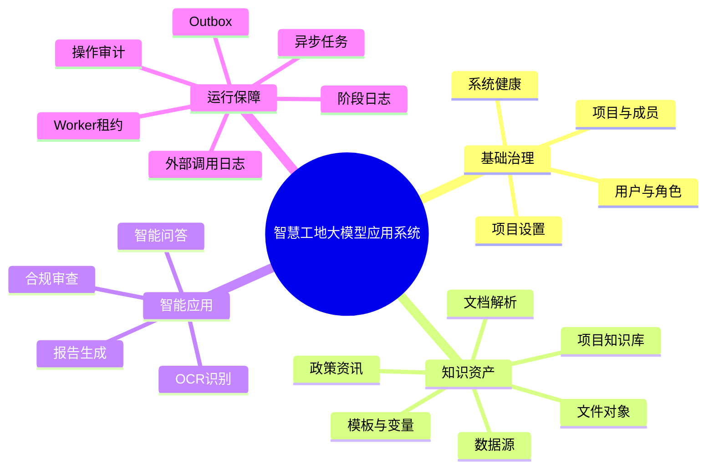
```mermaid
mindmap
  root((智慧工地大模型应用系统))
    基础治理
      用户与角色
      项目与成员
      项目设置
      系统健康
    知识资产
      文件对象
      文档解析
      模板与变量
      项目知识库
      数据源
      政策资讯
    智能应用
      智能问答
      合规审查
      报告生成
      OCR识别
    运行保障
      异步任务
      Outbox
      Worker租约
      阶段日志
      操作审计
      外部调用日志
```

### 1.5 当前实现成熟度

| 能力域 | 当前状态 | 说明 |
| --- | --- | --- |
| 系统、认证、用户、角色、项目 | 已实现基础闭环 | JWT、黑名单、登录锁定、项目隔离、内置角色保护 |
| 文件与解析 | 已实现 | 对象存储、解析记录、本地异步解析；存在 AI 边界遗留偏差 |
| 模板 | 已实现 | 预览、变量扫描、报告变量描述、审查规则 |
| 知识库 | 已实现基础闭环 | 文档上传、解析依赖、异步 Python RAG 索引 |
| 数据源与数据库问答 | 已实现 | AES-GCM、真实 JDBC、只读 SQL 安全控制 |
| QA | 已实现基础闭环 | 多路由、引用、反馈、Python AI 调用 |
| 长文档审查 | 已实现 | 异步解析、分块、逐规则归约、证据持久化 |
| 报告生成 | 已实现 Word 路径 | 单知识库、逐变量生成、DOCX 渲染、失败续跑 |
| OCR | 已实现接口与 Python 调用 | 当前执行仍为本地异步，尚未统一到任务 Outbox |
| 政策资讯 | 已实现基础闭环 | 来源、采集任务、文章、Python 抽取、RAG 入库 |
| 任务与审计 | 已实现基础设施 | Outbox、Redis、租约、重试、取消、阶段与调用日志 |
| 生产部署与告警 | 规划完善 | 当前 Compose 只启动 MySQL、Redis、MinIO |

---

## 2. 架构原则、约束与关键决策

> **本章总结：** 系统的首要架构原则是“业务控制权在 Java、智能算法能力在 Python、交互只经由 Java、数据按项目隔离、耗时操作必须可追踪”。这些原则不是代码风格偏好，而是安全、事务一致性、可观测性和团队协作的边界。所有新增能力都应服从模块化单体分层、外部能力适配、显式失败、写入效果确认、逻辑删除和异步任务可靠投递等约束。

### 2.1 关键架构决策

| 编号 | 决策 | 原因 | 影响 |
| --- | --- | --- | --- |
| ADR-01 | Java 主系统采用模块化单体 | 降低一期部署与事务复杂度 | 模块内部独立分层，禁止跨模块 Mapper |
| ADR-02 | Python 作为智能算法服务 | 便于接入模型、RAG、向量库和 AI 生态 | Java 通过 REST 适配器调用 |
| ADR-03 | 前端只调用 Java | 统一鉴权、审计、项目隔离和错误处理 | 禁止直连 Python、MinIO、数据库、向量库 |
| ADR-04 | MySQL 是业务状态事实源 | 业务状态需要事务、一致性和可查询性 | Redis 不得成为唯一任务状态 |
| ADR-05 | 任务采用 Outbox + Redis | 解决数据库提交与消息投递双写问题 | `task_outbox` 持久化后再异步投递 |
| ADR-06 | 文件内容存 MinIO，元数据存 MySQL | 避免大对象占用业务库 | 通过 `file_id` 关联业务 |
| ADR-07 | 知识切片和向量只由 Python 管理 | 避免 Java 耦合 Embedding 与向量引擎 | Java 只提交解析内容和查询条件 |
| ADR-08 | 数据库问答由 Python 规划、Java 执行 | 同时获得自然语言能力和数据库安全控制 | Java 严格验证只读 SQL |
| ADR-09 | 审查按“块证据—规则归约—最终摘要”三层执行 | 避免单块无证据误判全文 | Java 确定总体三态结论 |
| ADR-10 | 报告按变量快照逐项生成 | 支持进度、失败定位和断点续跑 | 每个变量即时持久化 |

### 2.2 强制分层

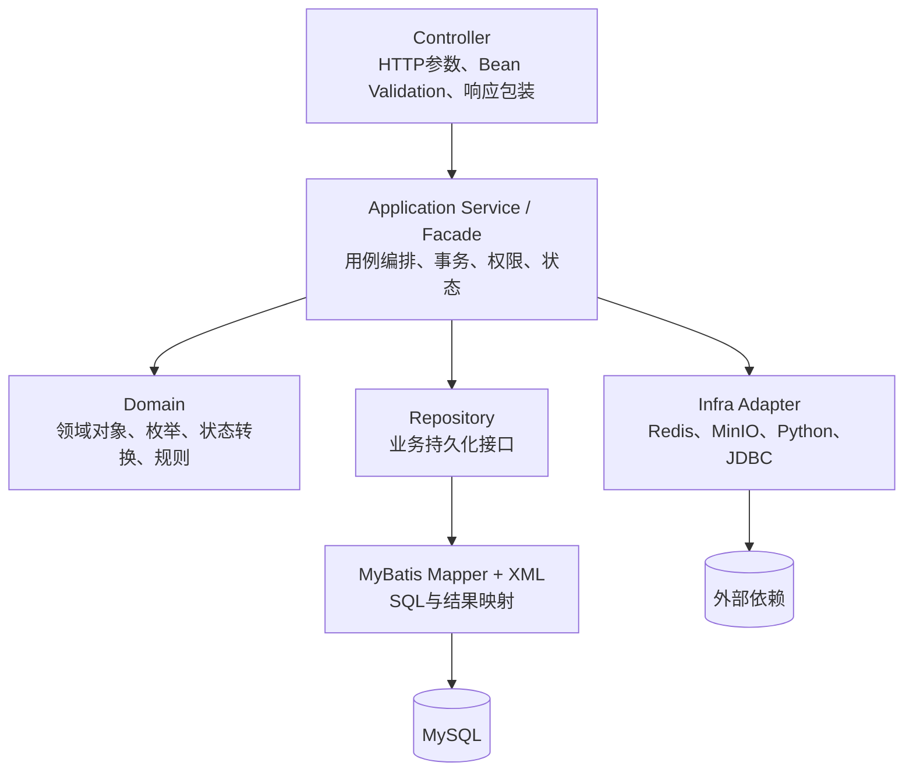
```mermaid
flowchart TD
    C[Controller<br/>HTTP参数、Bean Validation、响应包装]
    A[Application Service / Facade<br/>用例编排、事务、权限、状态]
    D[Domain<br/>领域对象、枚举、状态转换、规则]
    R[Repository<br/>业务持久化接口]
    M[MyBatis Mapper + XML<br/>SQL与结果映射]
    I[Infra Adapter<br/>Redis、MinIO、Python、JDBC]
    DB[(MySQL)]
    EXT[(外部依赖)]

    C --> A
    A --> D
    A --> R
    A --> I
    R --> M
    M --> DB
    I --> EXT
```

禁止的调用包括：

- Controller 直接调用 Mapper、Redis、MinIO、Python 或数据库。
- 一个业务模块直接调用另一个模块的 Mapper。
- 前端直接访问 Python、数据库、MinIO、向量库或模型。
- Java Controller/Application Service 编写模型 Prompt、Embedding、OCR 或向量检索核心算法。
- Worker 依赖请求线程 `SecurityContext`。
- 用默认内容、空列表或假成功隐藏外部服务、存储或持久化失败。

### 2.3 项目隔离与可写性

所有项目级能力都必须经过 `ProjectAccessApplicationService`：

| 场景 | 入口 |
| --- | --- |
| 用户读 | `requireProjectAccess` |
| 用户管理 | `requireProjectManage` |
| 用户写 | `requireProjectWritableAccess` / `requireProjectWritableManage` |
| 后台 Worker 写 | `requireProjectWritableForSystem` |

项目状态规则：

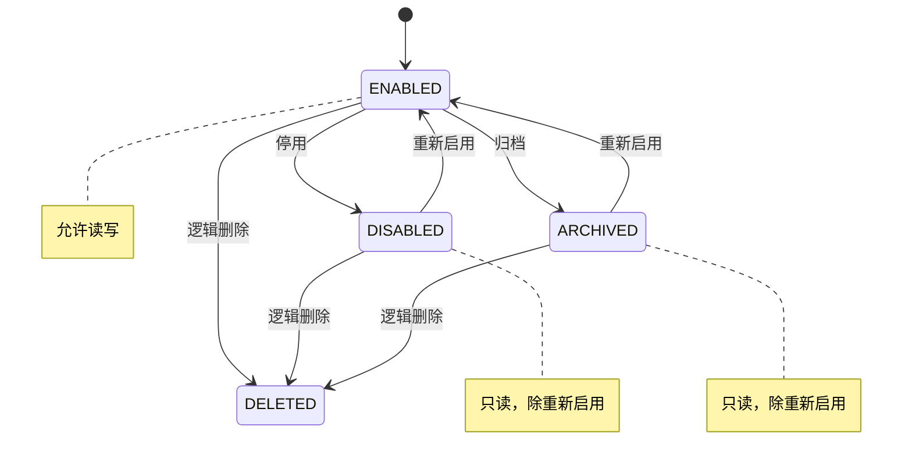
```mermaid
stateDiagram-v2
    [*] --> ENABLED
    ENABLED --> DISABLED: 停用
    ENABLED --> ARCHIVED: 归档
    DISABLED --> ENABLED: 重新启用
    ARCHIVED --> ENABLED: 重新启用
    ENABLED --> DELETED: 逻辑删除
    DISABLED --> DELETED: 逻辑删除
    ARCHIVED --> DELETED: 逻辑删除

    note right of ENABLED
      允许读写
    end note
    note right of DISABLED
      只读，除重新启用
    end note
    note right of ARCHIVED
      只读，除重新启用
    end note
```

### 2.4 显式失败与写入确认

关键写入必须检查：

- `insert/update/delete` 影响行数。
- 自增 ID 是否生成；必要时按业务键读回。
- API 返回持久化对象前是否能从数据库重新读取。
- 外部调用成功后所需的调用日志是否成功写入。
- 失败状态、阶段日志和 Outbox 失败原因是否成功写入。

零行更新意味着记录缺失、状态已变化或并发冲突，应返回 `40900`，不得报告成功。

### 2.5 当前实现偏差

| 偏差 | 当前事实 | 目标收敛 |
| --- | --- | --- |
| 文件解析 AI 边界 | `file` 模块仍有 `QwenVlDocumentParseAdapter` 和 Java 侧 Qwen-VL 配置 | 改为 Java 调用 `python-ai-service` 文档解析 API；Qwen Key 只留在 Python |
| OCR 任务执行 | OCR 使用 `@Async("ocrTaskExecutor")`，直接更新任务表 | 改为写 `task_outbox`，由统一 Worker claim、租约、心跳和 owner 校验执行 |
| 文件解析任务执行 | 文件解析使用本地 `@Async`，不是统一 Outbox | 逐步纳入统一任务或可靠解析事件链 |
| 生产部署 | Compose 仅包含 MySQL、Redis、MinIO | 补齐前端、Java、Python、网关、向量库、监控与备份 |
| 旧文档状态 | 部分需求表仍将已实现能力标为规划中 | 以 Controller、README、模块 API 和本文档为现行事实 |

---

## 3. 总体架构

> **本章总结：** 系统采用清晰的三服务边界：Vue 负责交互，Java 负责企业业务和系统控制，Python 负责智能算法。MySQL 保存业务事实，MinIO 保存文件与大文本对象，Redis 负责缓存、令牌安全和任务投递，向量存储由 Python 独占访问。该结构在当前阶段以模块化单体获得较低运维复杂度，同时通过领域模块、适配器和消息边界为后续服务拆分保留空间。

### 3.1 系统上下文图

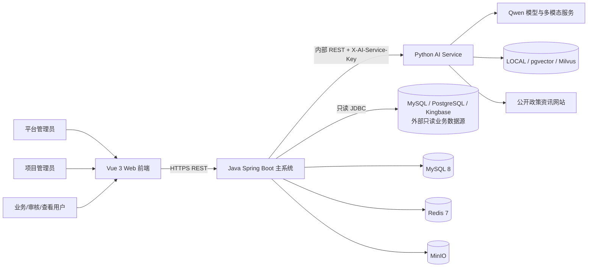
```mermaid
flowchart LR
    U1[平台管理员]
    U2[项目管理员]
    U3[业务/审核/查看用户]
    FE[Vue 3 Web 前端]
    JAVA[Java Spring Boot 主系统]
    PY[Python AI Service]
    BIZ[(MySQL / PostgreSQL / Kingbase<br/>外部只读业务数据源)]
    MODEL[Qwen 模型与多模态服务]
    VDB[(LOCAL / pgvector / Milvus)]
    WEB[公开政策资讯网站]
    MYSQL[(MySQL 8)]
    REDIS[(Redis 7)]
    MINIO[(MinIO)]

    U1 --> FE
    U2 --> FE
    U3 --> FE
    FE -->|HTTPS REST| JAVA
    JAVA --> MYSQL
    JAVA --> REDIS
    JAVA --> MINIO
    JAVA -->|内部 REST + X-AI-Service-Key| PY
    JAVA -->|只读 JDBC| BIZ
    PY --> MODEL
    PY --> VDB
    PY --> WEB
```

### 3.2 容器级架构

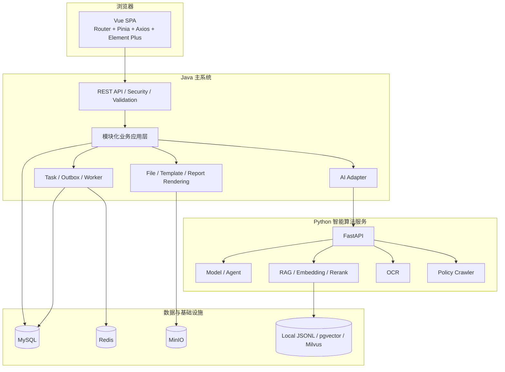
```mermaid
flowchart TB
    subgraph Browser[浏览器]
        SPA[Vue SPA<br/>Router + Pinia + Axios + Element Plus]
    end

    subgraph JavaApp[Java 主系统]
        WEBAPI[REST API / Security / Validation]
        BIZAPP[模块化业务应用层]
        AIT[AI Adapter]
        TASK[Task / Outbox / Worker]
        FILE[File / Template / Report Rendering]
    end

    subgraph PythonApp[Python 智能算法服务]
        PAPI[FastAPI]
        MS[Model / Agent]
        RAG[RAG / Embedding / Rerank]
        OCR[OCR]
        CRAWL[Policy Crawler]
    end

    subgraph Data[数据与基础设施]
        DB[(MySQL)]
        MQ[(Redis)]
        OBJ[(MinIO)]
        VECTOR[(Local JSONL / pgvector / Milvus)]
    end

    SPA --> WEBAPI
    WEBAPI --> BIZAPP
    BIZAPP --> FILE
    BIZAPP --> AIT
    BIZAPP --> TASK
    BIZAPP --> DB
    FILE --> OBJ
    TASK --> DB
    TASK --> MQ
    AIT --> PAPI
    PAPI --> MS
    PAPI --> RAG
    PAPI --> OCR
    PAPI --> CRAWL
    RAG --> VECTOR
```

### 3.3 组件责任边界

| 组件 | 拥有的职责 | 明确不负责 |
| --- | --- | --- |
| Vue 前端 | 页面、路由、状态、表单、轮询、预览、下载交互 | 业务授权最终判断、AI、存储和数据库直连 |
| Java 主系统 | 鉴权、项目隔离、业务编排、状态、任务、文件、审计、SQL 安全 | 模型算法、Embedding、向量检索核心实现 |
| Python AI 服务 | 模型、Agent、RAG、Embedding、rerank、OCR、网页抽取 | Java 业务库写入、用户权限、MinIO 元数据管理 |
| MySQL | 业务元数据、任务、审计、状态与关系 | 二进制文件和向量 |
| Redis | 缓存、JWT 黑名单、登录失败锁定、轻量队列 | 业务事实源 |
| MinIO | 原文件、模板、解析结果、文档块、报告 | 权限与业务关系 |
| 向量存储 | 文档切片向量和相似度检索 | Java 业务元数据 |

### 3.4 网络与信任边界

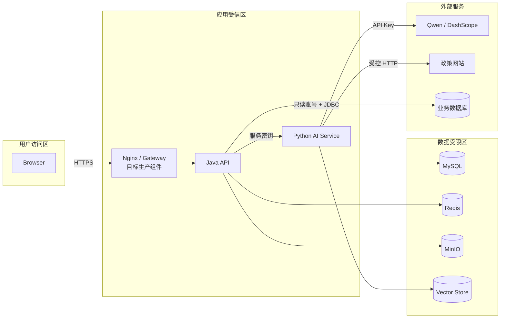
```mermaid
flowchart LR
    subgraph Public[用户访问区]
        B[Browser]
    end
    subgraph AppZone[应用受信区]
        N[Nginx / Gateway<br/>目标生产组件]
        J[Java API]
        P[Python AI Service]
    end
    subgraph DataZone[数据受限区]
        M[(MySQL)]
        R[(Redis)]
        O[(MinIO)]
        V[(Vector Store)]
    end
    subgraph External[外部服务]
        Q[Qwen / DashScope]
        W[政策网站]
        D[(业务数据库)]
    end

    B -->|HTTPS| N
    N --> J
    J -->|服务密钥| P
    J --> M
    J --> R
    J --> O
    J -->|只读账号 + JDBC| D
    P --> V
    P -->|API Key| Q
    P -->|受控 HTTP| W
```

---

## 4. Java 后端分层与模块设计

> **本章总结：** Java 主系统是业务控制中枢，目前包含 16 个领域与基础模块。每个模块遵循 Controller、Application、Domain、Repository、Mapper、Infra 的分层方式；模块间通过应用服务或 Facade 协作，项目模块提供隔离基础，文件模块提供统一对象能力，AI 模块提供 Python 适配，任务模块提供可靠执行骨架。这样的设计让业务事务、权限和状态留在 Java 内部，又避免把模型细节扩散到各业务模块。

### 4.1 模块总览

| 模块 | 核心职责 | 关键依赖 |
| --- | --- | --- |
| `common` | 统一响应、错误码、requestId、Security、Redis、MyBatis 配置 | Spring 基础设施 |
| `system` | ping、版本、运行时、MySQL/Redis/MinIO 健康 | common、基础设施 |
| `auth` | 登录、退出、用户、角色、权限、项目成员 | common、project 数据 |
| `project` | 项目 CRUD、状态、配置、统计、访问校验 | auth、audit |
| `file` | 文件元数据、MinIO、临时 URL、文件解析记录 | project、task/本地异步 |
| `template` | REPORT/REVIEW 模板、预览、变量/规则扫描与描述 | file、project |
| `ai` | Python 智能能力适配、路由、RAG、数据库问答与外部调用日志 | project、audit、Python AI 服务 |
| `knowledge` | 知识库、文档、索引任务 | file、task、ai、project |
| `datasource` | 数据源配置、AES-GCM、连接测试、Schema | project、ai 配置 |
| `qa` | 会话、消息、引用、反馈、路由编排 | ai、knowledge、datasource、project |
| `review` | 异步长文档审查、规则快照、证据和问题 | file、template、task、ai |
| `report` | 报告、变量快照、逐变量生成、DOCX 渲染 | template、knowledge、qa、task、file |
| `ocr` | OCR 记录、字段、修订、Python OCR 调用 | file、project、ai |
| `policy` | 来源、采集任务、文章、RAG 入库 | project、task、ai |
| `task` | 查询、统计、重试、取消、Outbox、Worker、租约 | Redis、MySQL、业务执行器 |
| `audit` | 操作日志和外部调用日志查询 | 各业务模块 |

### 4.2 模块依赖关系

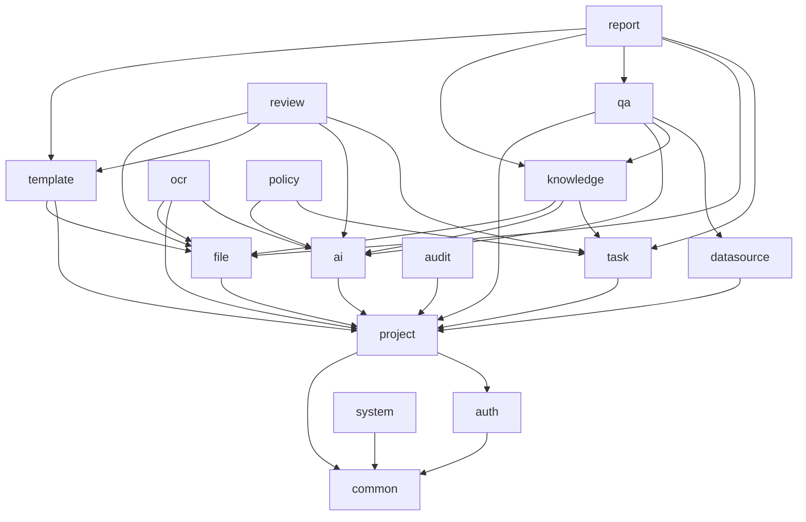
```mermaid
flowchart TB
    COMMON[common]
    PROJECT[project]
    AUTH[auth]
    FILE[file]
    TEMPLATE[template]
    AI[ai]
    TASK[task]
    KNOW[knowledge]
    DS[datasource]
    QA[qa]
    REVIEW[review]
    REPORT[report]
    OCR[ocr]
    POLICY[policy]
    AUDIT[audit]
    SYSTEM[system]

    AUTH --> COMMON
    PROJECT --> COMMON
    PROJECT --> AUTH
    FILE --> PROJECT
    TEMPLATE --> FILE
    TEMPLATE --> PROJECT
    AI --> PROJECT
    DS --> PROJECT
    QA --> PROJECT
    QA --> AI
    QA --> KNOW
    QA --> DS
    KNOW --> FILE
    KNOW --> AI
    KNOW --> TASK
    REVIEW --> FILE
    REVIEW --> TEMPLATE
    REVIEW --> AI
    REVIEW --> TASK
    REPORT --> TEMPLATE
    REPORT --> KNOW
    REPORT --> QA
    REPORT --> FILE
    REPORT --> TASK
    OCR --> FILE
    OCR --> PROJECT
    OCR --> AI
    POLICY --> AI
    POLICY --> TASK
    TASK --> PROJECT
    AUDIT --> PROJECT
    SYSTEM --> COMMON
```

图中的箭头表示应用服务级依赖，不授权跨模块访问 Mapper。

### 4.3 通用请求处理链

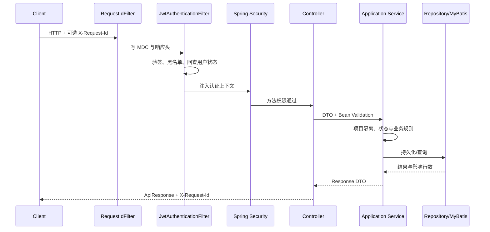
```mermaid
sequenceDiagram
    participant C as Client
    participant R as RequestIdFilter
    participant J as JwtAuthenticationFilter
    participant S as Spring Security
    participant CT as Controller
    participant AS as Application Service
    participant DB as Repository/MyBatis

    C->>R: HTTP + 可选 X-Request-Id
    R->>J: 写 MDC 与响应头
    J->>J: 验签、黑名单、回查用户状态
    J->>S: 注入认证上下文
    S->>CT: 方法权限通过
    CT->>AS: DTO + Bean Validation
    AS->>AS: 项目隔离、状态与业务规则
    AS->>DB: 持久化/查询
    DB-->>AS: 结果与影响行数
    AS-->>CT: Response DTO
    CT-->>C: ApiResponse + X-Request-Id
```

### 4.4 通用响应和错误

业务 JSON 响应：

```json
{
  "code": 0,
  "message": "success",
  "data": {},
  "requestId": "request-id",
  "timestamp": "2026-07-23T10:00:00+08:00"
}
```

现行错误码：

| code | 含义 |
| --- | --- |
| `40000` | 参数错误 |
| `40100` | 未认证 |
| `40300` | 无权限 |
| `40400` | 资源不存在 |
| `40900` | 状态或并发冲突 |
| `42900` | 请求过频或账户临时锁定 |
| `50000` | 系统错误 |
| `50200` | 外部服务异常 |
| `50300` | 服务不可用 |

现行实现对大多数 `BusinessException`、认证和授权错误使用 HTTP 200 加业务 `code`；Bean Validation 使用 HTTP 400，未捕获异常使用 HTTP 500。前端必须同时处理 HTTP 状态和业务 `code`。

### 4.5 模块内结构模板

```text
com.xd.smartworksite.<module>/
  controller/      REST 入口
  application/     用例编排和事务
  domain/          领域实体、枚举、状态
  dto/             Request/Response
  repository/      持久化抽象与 MyBatis 实现
  mapper/          Mapper 接口
  infra/           外部适配与技术实现
```

---

## 5. 前端系统设计

> **本章总结：** 前端采用 Vue 3 单页应用，以“用户任务”而不是后端技术模块组织导航。它通过统一 Axios 实例处理 Token、requestId、统一响应和错误跳转，通过 Pinia 保存用户与当前项目，通过 Vue Router 实施路由权限，通过通用组件统一上传、表格、状态、进度、JSON 和下载。前端只做交互级权限保护，Java 后端仍是授权与状态机的最终事实来源。

### 5.1 技术结构

| 技术 | 用途 |
| --- | --- |
| Vue 3 + TypeScript | 组件与类型化业务页面 |
| Vite | 开发和构建 |
| Pinia | 用户、项目等全局状态 |
| Vue Router | History 路由、权限守卫、懒加载 |
| Axios | 统一 HTTP、Blob 和预签名下载 |
| Element Plus | 企业管理端组件 |
| docx-preview | DOCX 模板前端预览 |
| read-excel-file | 表格模板前端预览 |

### 5.2 信息架构与导航

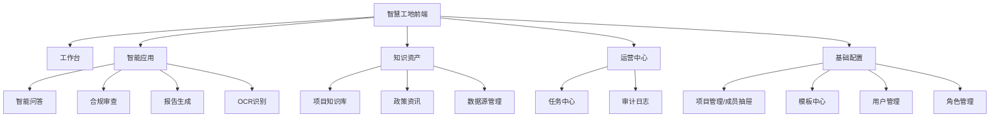
```mermaid
flowchart TD
    ROOT[智慧工地前端]
    ROOT --> DASH[工作台]
    ROOT --> INTEL[智能应用]
    ROOT --> ASSET[知识资产]
    ROOT --> OPS[运营中心]
    ROOT --> CONFIG[基础配置]

    INTEL --> QA[智能问答]
    INTEL --> REVIEW[合规审查]
    INTEL --> REPORT[报告生成]
    INTEL --> OCR[OCR识别]

    ASSET --> KB[项目知识库]
    ASSET --> POLICY[政策资讯]
    ASSET --> DS[数据源管理]

    OPS --> TASK[任务中心]
    OPS --> AUDIT[审计日志]

    CONFIG --> PROJECT[项目管理/成员抽屉]
    CONFIG --> TEMPLATE[模板中心]
    CONFIG --> USER[用户管理]
    CONFIG --> ROLE[角色管理]
```

工作台首屏突出四个主动作：

1. 问知识、查数据。
2. 审文档。
3. 生成报告。
4. 识别材料。

### 5.3 目录与职责

| 目录 | 职责 |
| --- | --- |
| `src/api` | 接口服务与类型，不在页面拼 URL |
| `src/components/common` | 上传、表格、空状态、JSON、状态、进度 |
| `src/components/review` | 审查历史等领域组件 |
| `src/layouts` | 固定左侧导航和顶部项目栏 |
| `src/router` | 路由、懒加载和权限守卫 |
| `src/stores` | 用户、项目和全局状态 |
| `src/utils` | request、requestId、Markdown、下载 |
| `src/views` | 各业务页面 |
| `src/mocks` | 显式开关的离线演示数据 |

### 5.4 前端请求链

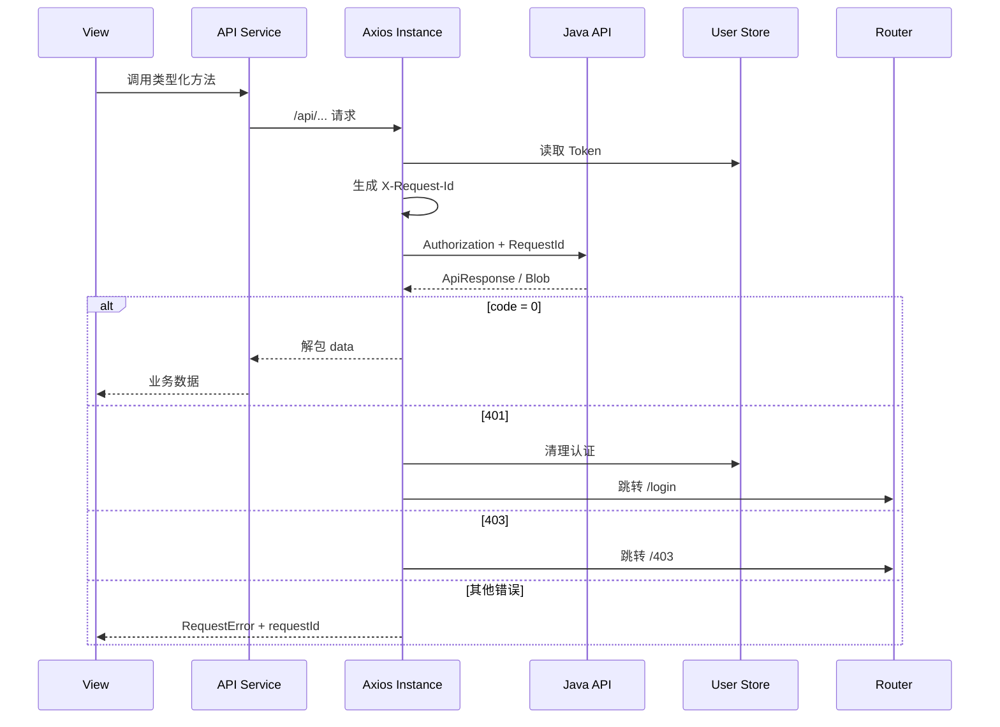
```mermaid
sequenceDiagram
    participant V as View
    participant API as API Service
    participant AX as Axios Instance
    participant J as Java API
    participant ST as User Store
    participant RT as Router

    V->>API: 调用类型化方法
    API->>AX: /api/... 请求
    AX->>ST: 读取 Token
    AX->>AX: 生成 X-Request-Id
    AX->>J: Authorization + RequestId
    J-->>AX: ApiResponse / Blob
    alt code = 0
        AX-->>API: 解包 data
        API-->>V: 业务数据
    else 401
        AX->>ST: 清理认证
        AX->>RT: 跳转 /login
    else 403
        AX->>RT: 跳转 /403
    else 其他错误
        AX-->>V: RequestError + requestId
    end
```

### 5.5 文件预览与下载

- 调用 Java 文件/报告接口获取 Blob 或 MinIO 预签名 URL。
- 对 Java API 请求附加 JWT 与 `X-Request-Id`。
- 对预签名 URL 使用干净的 Axios 请求，禁止附加应用 JWT 和 `X-Request-Id`，避免凭据泄露和 MinIO “multiple authentication types”。
- Blob 若实际为 JSON 错误，前端先解析统一错误结构再提示。

### 5.6 长任务交互

- 创建接口立即返回业务 ID、`taskId` 和初始状态。
- 页面轮询业务详情、任务详情或阶段日志。
- 非终态展示进度、当前阶段和占位反馈。
- 仅在状态机允许时启用重试、取消、下载、查看内容或重新生成按钮。
- 项目切换时清空上一个项目的详情和轮询状态。

### 5.7 UI 设计原则

- 浅色企业管理端，工业蓝为主色，青绿与工程橙为强调色。
- 左侧导航、顶部项目栏固定，内容区独立滚动。
- 每页显式处理 loading、empty、error。
- AI 结果尽量展示来源、置信度、引用、trace 或原始 JSON 摘要。
- 不采用纯大屏、暗黑优先或消费级花哨聊天风格。

---

## 6. Python 智能算法服务设计

> **本章总结：** Python 服务是统一智能能力边界，使用 FastAPI 暴露稳定的内部 REST 契约，在其内部封装 Qwen、RAG、向量存储、rerank、Agent 工具、OCR 和政策网页抽取。Java 不感知供应商请求格式，只传业务上下文并接收规范化结果。所有模型密钥应只存在于 Python 运行环境，Python 不写 Java 的业务数据库、MinIO 元数据或任务状态。

### 6.1 当前内部 API

| 方法与路径 | 能力 |
| --- | --- |
| `GET /v1/health` | Python 服务健康 |
| `POST /v1/model/invoke` | 大模型生成 |
| `POST /v1/agent/invoke` | Agent 推理与工具调用 |
| `POST /v1/rag/search` | RAG 检索与 rerank |
| `POST /v1/rag/index` | 切片、Embedding、向量入库 |
| `POST /v1/route` | 智能路由 |
| `POST /v1/context/prepare` | 上下文压缩与补充问题 |
| `POST /v1/database/generate-query` | 生成只读 SQL 方案 |
| `POST /v1/database/summarize-result` | 总结 Java 执行结果 |
| `POST /v1/ocr/recognize` | OCR 与自定义字段抽取 |
| `POST /v1/policy/crawl` | 公开网页内容抽取 |

Java 使用 `X-AI-Service-Key` 进行服务间鉴权。

### 6.2 Python 内部组件

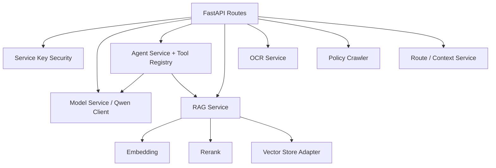
```mermaid
flowchart TD
    API[FastAPI Routes]
    SEC[Service Key Security]
    MODEL[Model Service / Qwen Client]
    AGENT[Agent Service + Tool Registry]
    RAG[RAG Service]
    EMB[Embedding]
    RR[Rerank]
    VS[Vector Store Adapter]
    OCR[OCR Service]
    POL[Policy Crawler]
    ROUTE[Route / Context Service]

    API --> SEC
    API --> MODEL
    API --> AGENT
    API --> RAG
    API --> OCR
    API --> POL
    API --> ROUTE
    AGENT --> MODEL
    AGENT --> RAG
    RAG --> EMB
    RAG --> RR
    RAG --> VS
```

### 6.3 RAG 设计

向量提供方：

```text
LOCAL      本地 JSONL，开发用途
PGVECTOR   PostgreSQL + pgvector
MILVUS     Milvus
```

Embedding：

```text
QWEN       生产路径
LOCAL_HASH 离线测试路径
```

检索链：

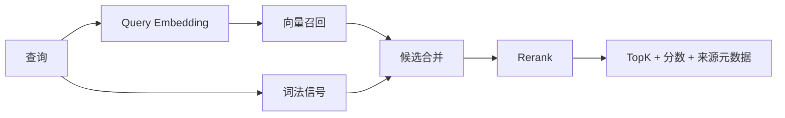
```mermaid
flowchart LR
    Q[查询] --> E[Query Embedding]
    E --> V[向量召回]
    Q --> L[词法信号]
    V --> M[候选合并]
    L --> M
    M --> R[Rerank]
    R --> F[TopK + 分数 + 来源元数据]
```

文档切片必须携带 `projectId`、`knowledgeBaseId`、`documentId`、标题、来源和定位元数据，使 Java 可以在业务层验证范围并向用户返回引用。

### 6.4 Agent 设计

- Agent 使用工具注册表，不允许任意执行未注册工具。
- 内置工具包括 `rag_search` 和 `database_query_plan`。
- Java 传入允许的工具集合和项目上下文。
- 工具调用摘要、步骤和 provider trace 返回 Java。
- Java 仍负责工具调用前后的权限、项目隔离和结果持久化。

### 6.5 OCR 设计

- 图片临时 URL 由 Python 下载后转换为 `data:image/...;base64,...`，不把内网 MinIO URL交给云模型。
- 支持 `ID_CARD`、`LICENSE_PLATE`、`INVOICE`、`CUSTOM`。
- 输出包含字段值、置信度、位置、页码、证据、extras 与 raw 摘要。
- `INVOICE` 必须指定 `VAT_SPECIAL` 或 `VAT_NORMAL`。
- 合同字段抽取使用 `CUSTOM` 和字段定义。
- PDF 尚需完善“文本提取或逐页渲染图片”的统一预处理。

### 6.6 政策采集设计

Python 只做：

- 下载公开 HTTP/HTTPS 页面。
- 去除常见页面噪声。
- 提取标题、正文、发布日期、政策编号等结构。

Java 负责：

- 来源配置、任务、项目权限。
- URL Hash 去重。
- 文章持久化。
- 外部调用日志。
- RAG 索引和状态。

### 6.7 密钥边界

只允许在 Python 中配置：

```text
QWEN_API_KEY
QWEN_VL_API_KEY
模型供应商相关密钥
```

Java 仅持有：

```text
AI_PYTHON_BASE_URL
AI_PYTHON_API_KEY
```

Java 当前 `file` 模块中的 Qwen-VL 配置属于待收敛遗留实现，不是目标边界。

---

## 7. 核心业务流程设计

> **本章总结：** 系统的业务闭环都遵循相同模式：用户在前端发起业务用例，Java 完成权限和项目校验、创建可追踪记录，必要时把耗时处理交给异步执行器，Python 只返回智能结果，Java 校验并持久化结果，前端通过业务状态或任务阶段展示进度。以下流程特别强调每一步的事实来源、失败路径和不可绕过的校验。

### 7.1 登录与认证流程

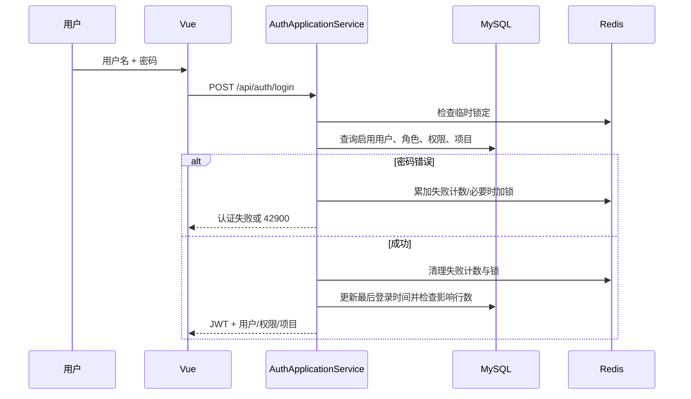
```mermaid
sequenceDiagram
    participant U as 用户
    participant FE as Vue
    participant J as AuthApplicationService
    participant DB as MySQL
    participant R as Redis

    U->>FE: 用户名 + 密码
    FE->>J: POST /api/auth/login
    J->>R: 检查临时锁定
    J->>DB: 查询启用用户、角色、权限、项目
    alt 密码错误
        J->>R: 累加失败计数/必要时加锁
        J-->>FE: 认证失败或 42900
    else 成功
        J->>R: 清理失败计数与锁
        J->>DB: 更新最后登录时间并检查影响行数
        J-->>FE: JWT + 用户/权限/项目
    end
```

后续每次请求都会验签、检查 JWT 黑名单并回查用户当前状态，已停用或删除用户不能依赖旧 Token 继续访问。

### 7.2 文件上传与解析

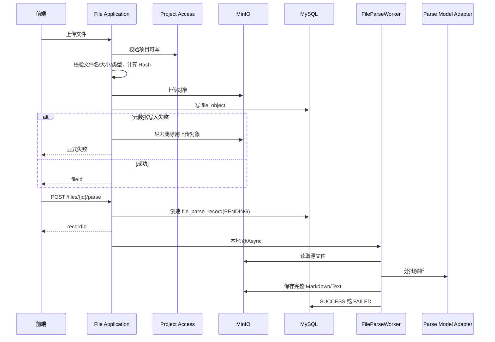
```mermaid
sequenceDiagram
    participant FE as 前端
    participant F as File Application
    participant P as Project Access
    participant O as MinIO
    participant DB as MySQL
    participant W as FileParseWorker
    participant M as Parse Model Adapter

    FE->>F: 上传文件
    F->>P: 校验项目可写
    F->>F: 校验文件名/大小/类型，计算 Hash
    F->>O: 上传对象
    F->>DB: 写 file_object
    alt 元数据写入失败
        F->>O: 尽力删除刚上传对象
        F-->>FE: 显式失败
    else 成功
        F-->>FE: fileId
    end
    FE->>F: POST /files/{id}/parse
    F->>DB: 创建 file_parse_record(PENDING)
    F-->>FE: recordId
    F->>W: 本地 @Async
    W->>O: 读取源文件
    W->>M: 分批解析
    W->>O: 保存完整 Markdown/Text
    W->>DB: SUCCESS 或 FAILED
```

完整文档长度超过 `FILE_PARSE_MAX_DOCUMENT_CHARS` 必须失败；超过单次模型输入窗口时按行边界分批并按源顺序合并，不允许静默截断。

### 7.3 知识库文档入库

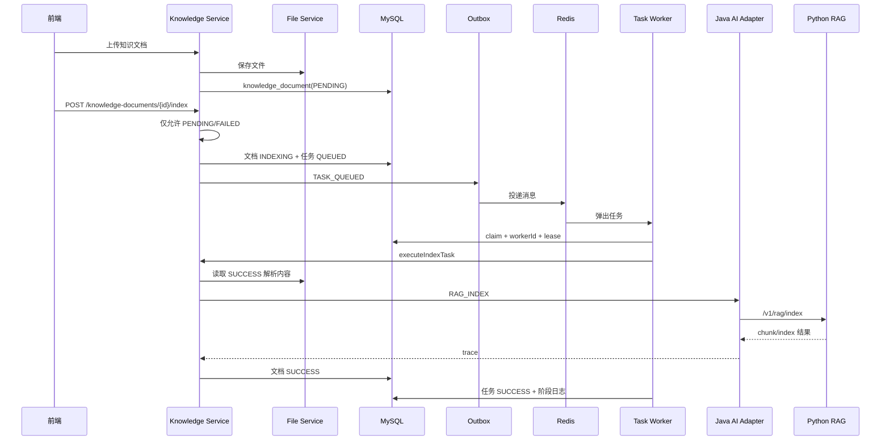
```mermaid
sequenceDiagram
    participant FE as 前端
    participant K as Knowledge Service
    participant F as File Service
    participant DB as MySQL
    participant O as Outbox
    participant R as Redis
    participant W as Task Worker
    participant A as Java AI Adapter
    participant P as Python RAG

    FE->>K: 上传知识文档
    K->>F: 保存文件
    K->>DB: knowledge_document(PENDING)
    FE->>K: POST /knowledge-documents/{id}/index
    K->>K: 仅允许 PENDING/FAILED
    K->>DB: 文档 INDEXING + 任务 QUEUED
    K->>O: TASK_QUEUED
    O->>R: 投递消息
    R->>W: 弹出任务
    W->>DB: claim + workerId + lease
    W->>K: executeIndexTask
    K->>F: 读取 SUCCESS 解析内容
    K->>A: RAG_INDEX
    A->>P: /v1/rag/index
    P-->>A: chunk/index 结果
    A-->>K: trace
    K->>DB: 文档 SUCCESS
    W->>DB: 任务 SUCCESS + 阶段日志
```

解析内容未就绪、为空、不可读或 Python 索引失败时，文档与任务显式失败。Java 不运行 Embedding，也不直接访问向量数据库。

### 7.4 智能问答

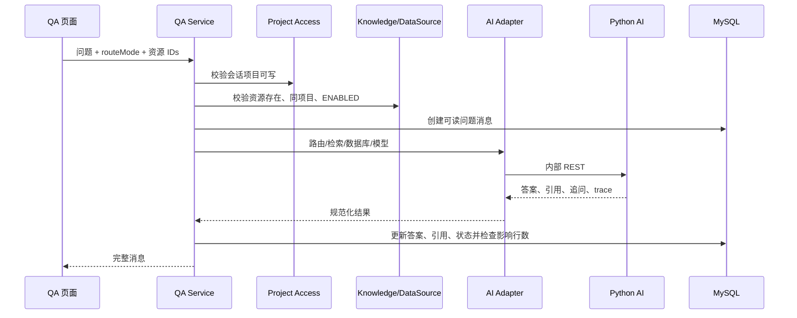
```mermaid
sequenceDiagram
    participant FE as QA 页面
    participant Q as QA Service
    participant P as Project Access
    participant K as Knowledge/DataSource
    participant A as AI Adapter
    participant PY as Python AI
    participant DB as MySQL

    FE->>Q: 问题 + routeMode + 资源 IDs
    Q->>P: 校验会话项目可写
    Q->>K: 校验资源存在、同项目、ENABLED
    Q->>DB: 创建可读问题消息
    Q->>A: 路由/检索/数据库/模型
    A->>PY: 内部 REST
    PY-->>A: 答案、引用、追问、trace
    A-->>Q: 规范化结果
    Q->>DB: 更新答案、引用、状态并检查影响行数
    Q-->>FE: 完整消息
```

路由模式：

```text
AUTO
MODEL
KNOWLEDGE
DATABASE
MIXED
```

问答失败不得生成兜底答案；前端发送和重新生成请求使用 120 秒专用超时，普通查询保持 15 秒。

### 7.5 数据库问答

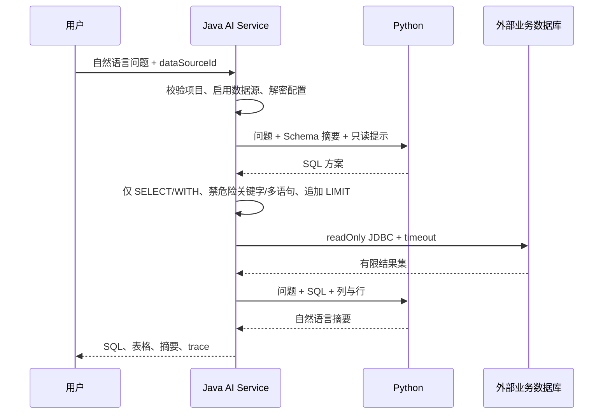
```mermaid
sequenceDiagram
    participant U as 用户
    participant J as Java AI Service
    participant P as Python
    participant D as 外部业务数据库

    U->>J: 自然语言问题 + dataSourceId
    J->>J: 校验项目、启用数据源、解密配置
    J->>P: 问题 + Schema 摘要 + 只读提示
    P-->>J: SQL 方案
    J->>J: 仅 SELECT/WITH、禁危险关键字/多语句、追加 LIMIT
    J->>D: readOnly JDBC + timeout
    D-->>J: 有限结果集
    J->>P: 问题 + SQL + 列与行
    P-->>J: 自然语言摘要
    J-->>U: SQL、表格、摘要、trace
```

### 7.6 长文档合规审查

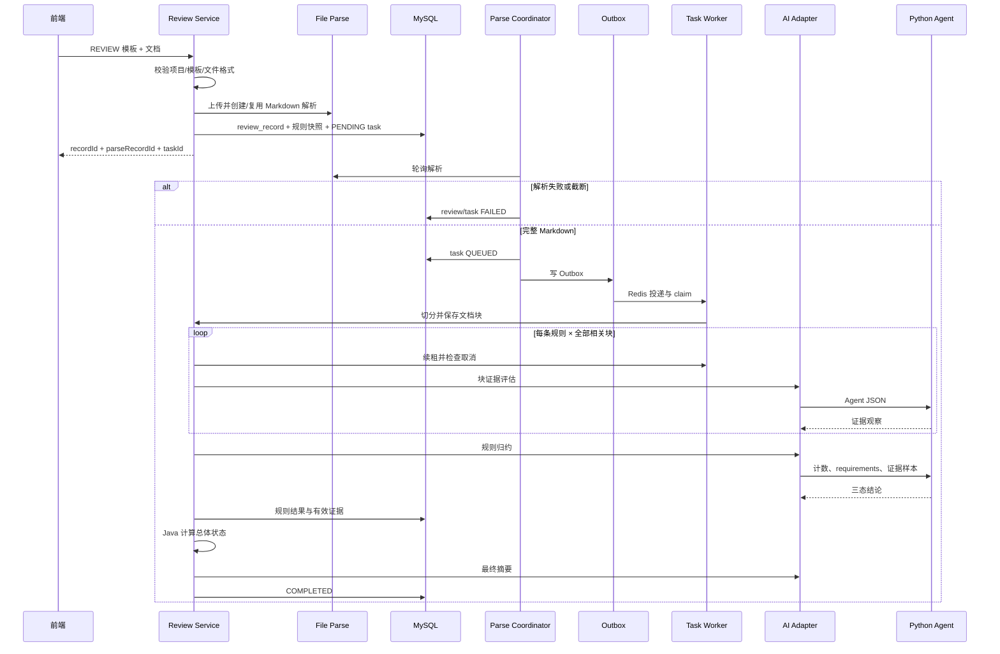
```mermaid
sequenceDiagram
    participant FE as 前端
    participant R as Review Service
    participant F as File Parse
    participant DB as MySQL
    participant C as Parse Coordinator
    participant O as Outbox
    participant W as Task Worker
    participant A as AI Adapter
    participant P as Python Agent

    FE->>R: REVIEW 模板 + 文档
    R->>R: 校验项目/模板/文件格式
    R->>F: 上传并创建/复用 Markdown 解析
    R->>DB: review_record + 规则快照 + PENDING task
    R-->>FE: recordId + parseRecordId + taskId
    C->>F: 轮询解析
    alt 解析失败或截断
        C->>DB: review/task FAILED
    else 完整 Markdown
        C->>DB: task QUEUED
        C->>O: 写 Outbox
        O->>W: Redis 投递与 claim
        W->>R: 切分并保存文档块
        loop 每条规则 × 全部相关块
            R->>W: 续租并检查取消
            R->>A: 块证据评估
            A->>P: Agent JSON
            P-->>A: 证据观察
        end
        R->>A: 规则归约
        A->>P: 计数、requirements、证据样本
        P-->>A: 三态结论
        R->>DB: 规则结果与有效证据
        R->>R: Java 计算总体状态
        R->>A: 最终摘要
        R->>DB: COMPLETED
    end
```

三层审查模型：

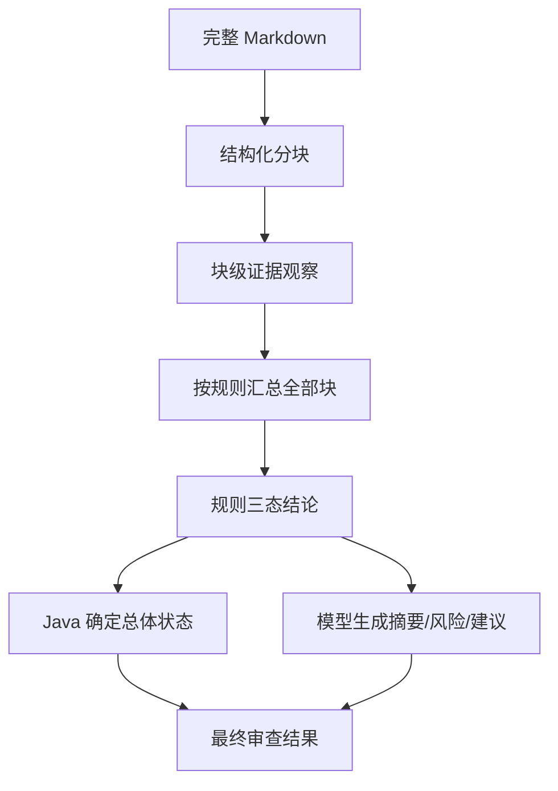
```mermaid
flowchart TD
    MD[完整 Markdown] --> CH[结构化分块]
    CH --> EV[块级证据观察]
    EV --> REDUCE[按规则汇总全部块]
    REDUCE --> RS[规则三态结论]
    RS --> JAVA[Java 确定总体状态]
    RS --> SUM[模型生成摘要/风险/建议]
    JAVA --> FINAL[最终审查结果]
    SUM --> FINAL
```

块级观察：

```text
SUPPORTING_EVIDENCE
VIOLATING_EVIDENCE
PARTIAL_EVIDENCE
NO_EVIDENCE
NOT_APPLICABLE
```

规则级结论：

```text
COMPLIANT
NON_COMPLIANT
PARTIALLY_COMPLIANT
```

`NO_EVIDENCE` 只说明当前块没有证据，不能直接判定全文不符合。最终总体状态由 Java 确定：存在不符合则整体不符合，否则存在部分符合则整体部分符合，否则整体符合。

### 7.7 报告生成

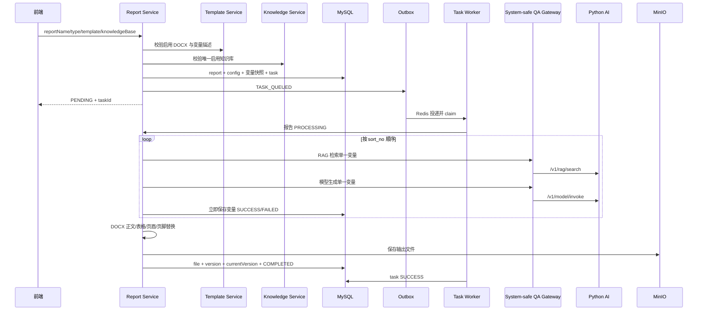
```mermaid
sequenceDiagram
    participant FE as 前端
    participant RP as Report Service
    participant T as Template Service
    participant K as Knowledge Service
    participant DB as MySQL
    participant O as Outbox
    participant W as Task Worker
    participant Q as System-safe QA Gateway
    participant P as Python AI
    participant M as MinIO

    FE->>RP: reportName/type/template/knowledgeBase
    RP->>T: 校验启用 DOCX 与变量描述
    RP->>K: 校验唯一启用知识库
    RP->>DB: report + config + 变量快照 + task
    RP->>O: TASK_QUEUED
    RP-->>FE: PENDING + taskId
    O->>W: Redis 投递并 claim
    W->>RP: 报告 PROCESSING
    loop 按 sort_no 顺序
        RP->>Q: RAG 检索单一变量
        Q->>P: /v1/rag/search
        RP->>Q: 模型生成单一变量
        Q->>P: /v1/model/invoke
        RP->>DB: 立即保存变量 SUCCESS/FAILED
    end
    RP->>RP: DOCX 正文/表格/页眉/页脚替换
    RP->>M: 保存输出文件
    RP->>DB: file + version + currentVersion + COMPLETED
    W->>DB: task SUCCESS
```

关键规则：

- 每份报告只选择一个同项目启用知识库。
- 每个变量使用独立空对话上下文，不写普通 QA 历史。
- 空检索结果可以继续模型生成通用内容，但禁止虚构项目具体数据。
- 单变量失败使报告失败，已成功变量保留；任务重试只补 `PENDING/FAILED`。
- 当前只支持 `WORD` 下载，PDF 请求明确失败。

### 7.8 OCR

```mermaid
sequenceDiagram
    participant FE as 前端
    participant O as OCR Service
    participant F as File Service
    participant DB as MySQL
    participant W as OcrRecognitionWorker
    participant P as Python OCR
    participant Q as Qwen VL

    FE->>O: 类型、文件、可选字段
    O->>F: 保存 OCR_INPUT
    O->>DB: ocr_record + generate_task(PENDING)
    O-->>FE: recordId + taskId
    O->>W: 本地 @Async
    W->>F: system-safe 临时下载 URL
    W->>P: /v1/ocr/recognize
    P->>P: 图片下载并转 base64 data URL
    P->>Q: 多模态识别
    Q-->>P: JSON
    P-->>W: 规范化 fields/extras/raw/trace
    W->>DB: SUCCESS/FAILED + 阶段日志
    FE->>O: 轮询详情/人工修订
```

此流程是当前事实；目标是将 OCR 投递和执行统一迁移至 Outbox Worker。

### 7.9 政策资讯采集

```mermaid
sequenceDiagram
    participant FE as 前端
    participant J as Policy Service
    participant DB as MySQL
    participant O as Outbox/Worker
    participant P as Python Crawler
    participant R as Python RAG

    FE->>J: 配置来源/触发采集
    J->>DB: policy_crawl_task + generate_task + outbox
    O->>J: claim 后执行
    J->>J: 校验项目、来源、默认知识库
    J->>P: /v1/policy/crawl
    P-->>J: 结构化文章
    J->>DB: URL Hash 去重并持久化
    J->>R: RAG 索引
    R-->>J: 索引结果
    J->>DB: 进度、计数和终态
```

---

## 8. 异步任务与可靠性设计

> **本章总结：** 任务系统以 `generate_task` 表记录业务执行状态，以 `task_outbox` 解决事务提交后可靠投递问题，以 Redis List 作为轻量交付通道，以 Worker claim、租约、心跳和 owner 校验防止重复或过期执行。重试、取消、阶段日志和失败记录都必须可观察。当前报告、知识入库、政策采集和长文档审查已经走该统一路径，文件解析与 OCR 仍保留本地异步路径。

### 8.1 任务类型

统一 Worker 当前支持：

```text
REPORT_GENERATION
KNOWLEDGE_INDEXING
POLICY_CRAWL
REVIEW_EXECUTION
```

其他任务记录还包括：

```text
FILE_PARSE
OCR_RECOGNITION
```

但后两者当前分别通过本地 `@Async` 执行，尚未完全纳入统一队列。

### 8.2 任务状态机

```mermaid
stateDiagram-v2
    [*] --> PENDING
    PENDING --> QUEUED: Outbox准备完成
    QUEUED --> RUNNING: Worker claim
    RUNNING --> SUCCESS: owner完成
    RUNNING --> FAILED: owner失败
    RUNNING --> CANCELED: 检测cancel_requested
    FAILED --> QUEUED: 手动重试且未超限
    PENDING --> CANCELED: 取消
    QUEUED --> CANCELED: 取消
    RETRYING --> QUEUED: 重新投递
    RETRYING --> CANCELED: 取消
    SUCCESS --> [*]
    FAILED --> [*]
    CANCELED --> [*]
```

### 8.3 Outbox 投递

```mermaid
sequenceDiagram
    participant B as Business Transaction
    participant DB as MySQL
    participant D as Outbox Dispatcher
    participant R as Redis
    participant W as Worker

    B->>DB: 写业务记录
    B->>DB: 写 generate_task(QUEUED)
    B->>DB: 写 task_outbox(PENDING)
    DB-->>B: 同事务提交
    D->>DB: 查询到期 Outbox
    D->>R: RPUSH task queue
    alt Redis 投递成功
        D->>DB: Outbox DELIVERED
    else 投递失败
        D->>DB: delivery_count + error + next_delivery_at
        Note over D,DB: 指数退避，最多 5 次
    end
    R->>W: LPOP/BLPOP 消息
```

Outbox 唯一键为 `task_id + event_type + deleted`，防止同一任务事件重复创建。

### 8.4 Worker claim 与租约

```mermaid
sequenceDiagram
    participant W1 as Worker A
    participant W2 as Worker B
    participant DB as MySQL

    W1->>DB: claim QUEUED task
    W2->>DB: claim 同一 task
    DB-->>W1: 更新 1 行，写 worker_id/lease
    DB-->>W2: 更新 0 行，不可领取
    W1->>DB: heartbeat/renewLease
    W1->>DB: completeSuccess/Failure with owner
    alt owner、状态、租约不匹配
        DB-->>W1: 0 行
        W1-->>W1: 409 冲突，不得静默完成
    end
```

### 8.5 重试与取消

重试：

- 仅 `FAILED` 且 `retry_count < max_retry_count`。
- 更新任务为 `QUEUED`，清理错误和取消标记。
- 写 `RETRY_REQUESTED` 阶段日志。
- 新建可投递 Outbox 事件。
- 业务模块必须实现幂等或按阶段恢复。

取消：

- `PENDING/QUEUED/RETRYING` 直接置 `CANCELED`。
- `RUNNING` 只写 `cancel_requested=true`。
- Worker 在阶段边界检查取消；长文档审查在每个块模型调用前续租并检查。
- 终态取消返回冲突。

### 8.6 阶段日志

`task_stage_log` 记录：

```text
task_id
attempt_no
stage_code
status
input_summary
output_summary
error_message
started_at
finished_at
cost_ms
```

阶段日志写入失败视为可观测性破坏，必须使相关操作失败。

### 8.7 本地异步路径风险

文件解析和 OCR 的本地线程池路径存在以下限制：

- 进程退出可能丢失内存中的待执行任务。
- 没有统一 claim、租约和 owner 校验。
- 水平扩容时重复执行控制较弱。
- OCR 对任务写入的影响行数检查不如统一 Worker 完整。

收敛建议：

1. 增加 `FILE_PARSE` 和 `OCR_RECOGNITION` 的统一 Worker 分派。
2. 创建记录与 Outbox 同事务。
3. Worker 使用 system-safe 文件访问。
4. 统一阶段、续租、取消和失败持久化。

---

## 9. 数据设计

> **本章总结：** MySQL 当前通过 19 个 Flyway 版本管理 33 张表，按身份项目、文件模板、知识数据、问答、审查、报告、OCR、任务审计八个领域组织。项目级表原则上包含 `project_id`，业务表包含标准审计字段和 `deleted` 逻辑删除标志；大文件和大段正文存 MinIO，JSON 字段只保存结构化扩展或结果快照，向量数据不进入 Java 业务库。

### 9.1 存储分工

| 存储 | 保存内容 |
| --- | --- |
| MySQL | 用户、权限、项目、业务元数据、任务、状态、审计、结构化结果 |
| MinIO | 原始文件、模板、解析全文、审查块、报告输出 |
| Redis | JWT 黑名单、登录失败锁、缓存、轻量任务队列 |
| Local/pgvector/Milvus | Python 管理的知识切片向量 |
| 外部业务数据库 | 被数据库问答只读访问的数据 |

### 9.2 全部现行表

| 数据域 | 表名 | 作用 |
| --- | --- | --- |
| 身份权限 | `user_account` | 用户账号与状态 |
| 身份权限 | `role` | 平台角色 |
| 身份权限 | `permission` | 菜单/API/按钮权限 |
| 身份权限 | `user_role` | 用户角色关系 |
| 身份权限 | `role_permission` | 角色权限关系 |
| 项目 | `project` | 项目、状态与 settings JSON |
| 项目 | `project_member` | 用户项目角色和成员状态 |
| 文件 | `file_object` | MinIO 对象元数据和业务绑定 |
| 文件 | `file_parse_record` | 解析状态、结果对象和元数据 |
| 模板 | `template` | REPORT/REVIEW 模板元数据 |
| 模板 | `template_variable_description` | 报告变量描述或审查规则 |
| 知识 | `knowledge_base` | 项目知识库 |
| 知识 | `knowledge_document` | 知识文档、索引任务和状态 |
| 数据源 | `data_source` | 加密的外部数据库配置 |
| 政策 | `policy_source` | 政策来源与频率 |
| 政策 | `policy_article` | 采集文章与索引状态 |
| 政策 | `policy_crawl_task` | 政策采集业务进度 |
| QA | `qa_session` | 问答会话 |
| QA | `qa_message` | 问题、答案、引用和反馈 |
| 审查 | `review_record` | 审查主状态和汇总 |
| 审查 | `review_document_chunk` | Markdown 块元数据和对象引用 |
| 审查 | `review_rule_result` | 规则快照、三态结论和证据 |
| 报告 | `report_config` | 报告生成配置快照 |
| 报告 | `report` | 报告主状态 |
| 报告 | `report_version` | 输出文件版本 |
| 报告 | `report_variable_value` | 有序变量快照、值和状态 |
| OCR | `ocr_record` | OCR 任务、字段 JSON 与状态 |
| 任务 | `generate_task` | 统一任务状态、租约与取消 |
| 任务 | `task_stage_log` | 任务阶段轨迹 |
| 任务 | `task_outbox` | 可靠投递事件 |
| 审计 | `audit_log` | 操作审计 |
| 审计 | `external_call_log` | 外部服务调用日志 |
| 配置 | `system_config` | 系统配置数据基础 |

### 9.3 身份与项目 ER 图

```mermaid
erDiagram
    USER_ACCOUNT ||--o{ USER_ROLE : has
    ROLE ||--o{ USER_ROLE : assigned
    ROLE ||--o{ ROLE_PERMISSION : grants
    PERMISSION ||--o{ ROLE_PERMISSION : included
    USER_ACCOUNT ||--o{ PROJECT_MEMBER : joins
    PROJECT ||--o{ PROJECT_MEMBER : contains
    PROJECT ||--o{ FILE_OBJECT : owns

    USER_ACCOUNT {
      bigint id PK
      varchar username UK
      varchar password_hash
      varchar status
      datetime last_login_at
      tinyint deleted
    }
    PROJECT {
      bigint id PK
      varchar project_code UK
      varchar status
      json settings
      tinyint deleted
    }
    PROJECT_MEMBER {
      bigint id PK
      bigint project_id
      bigint user_id
      varchar project_role
      varchar status
    }
```

### 9.4 文件、知识和模板 ER 图

```mermaid
erDiagram
    PROJECT ||--o{ FILE_OBJECT : owns
    FILE_OBJECT ||--o{ FILE_PARSE_RECORD : parsed_as
    PROJECT ||--o{ KNOWLEDGE_BASE : owns
    KNOWLEDGE_BASE ||--o{ KNOWLEDGE_DOCUMENT : contains
    FILE_OBJECT ||--o{ KNOWLEDGE_DOCUMENT : source
    PROJECT ||--o{ TEMPLATE : owns
    FILE_OBJECT ||--o{ TEMPLATE : binds
    TEMPLATE ||--o{ TEMPLATE_VARIABLE_DESCRIPTION : defines
    FILE_OBJECT ||--o{ TEMPLATE_VARIABLE_DESCRIPTION : version_scope

    FILE_OBJECT {
      bigint id PK
      bigint project_id
      varchar biz_type
      bigint biz_id
      varchar object_name
      varchar file_hash
      varchar status
    }
    KNOWLEDGE_DOCUMENT {
      bigint id PK
      bigint knowledge_base_id
      bigint file_id
      varchar index_status
      bigint task_id
      text error_message
    }
    TEMPLATE_VARIABLE_DESCRIPTION {
      bigint id PK
      bigint template_id
      bigint file_id
      varchar variable_name
      varchar description
    }
```

### 9.5 报告与审查 ER 图

```mermaid
erDiagram
    PROJECT ||--o{ REPORT : owns
    REPORT_CONFIG ||--o{ REPORT : configures
    TEMPLATE ||--o{ REPORT : renders
    REPORT ||--o{ REPORT_VERSION : versions
    REPORT ||--o{ REPORT_VARIABLE_VALUE : variables
    KNOWLEDGE_BASE ||--o{ REPORT_VARIABLE_VALUE : grounds
    GENERATE_TASK ||--o{ REPORT_VARIABLE_VALUE : executes

    PROJECT ||--o{ REVIEW_RECORD : owns
    TEMPLATE ||--o{ REVIEW_RECORD : governs
    FILE_OBJECT ||--o{ REVIEW_RECORD : reviewed
    FILE_PARSE_RECORD ||--o{ REVIEW_RECORD : parsed_by
    REVIEW_RECORD ||--o{ REVIEW_DOCUMENT_CHUNK : chunks
    REVIEW_RECORD ||--o{ REVIEW_RULE_RESULT : rules

    REPORT_VARIABLE_VALUE {
      bigint id PK
      bigint report_id
      varchar variable_name
      text variable_description
      longtext variable_value
      int sort_no
      varchar status
    }
    REVIEW_RULE_RESULT {
      bigint id PK
      bigint review_record_id
      varchar rule_code
      text rule_description
      varchar execution_status
      varchar compliance_status
      json evidence_json
    }
```

### 9.6 任务与审计 ER 图

```mermaid
erDiagram
    PROJECT ||--o{ GENERATE_TASK : owns
    GENERATE_TASK ||--o{ TASK_STAGE_LOG : traces
    GENERATE_TASK ||--o{ TASK_OUTBOX : publishes
    PROJECT ||--o{ AUDIT_LOG : scopes
    PROJECT ||--o{ EXTERNAL_CALL_LOG : scopes
    GENERATE_TASK ||--o| POLICY_CRAWL_TASK : specializes

    GENERATE_TASK {
      bigint id PK
      bigint project_id
      varchar task_type
      varchar status
      boolean cancel_requested
      varchar worker_id
      datetime lease_until
      datetime last_heartbeat_at
    }
    TASK_OUTBOX {
      bigint id PK
      bigint task_id
      varchar event_type
      json payload
      varchar status
      int delivery_count
      datetime next_delivery_at
    }
```

### 9.7 数据建模规则

- 业务表默认使用 `id`、`created_at`、`updated_at`、`created_by`、`updated_by`、`deleted`。
- 项目级表保存 `project_id`。
- 查询默认过滤 `deleted = 0`。
- 不依赖数据库外键表达全部领域约束，项目归属和状态由应用层检查。
- JSON 必须由应用层校验并序列化，通过普通 MyBatis 参数写入；禁止 Mapper 使用 `CAST(? AS JSON)`。
- 不能把密码、Token、密钥、永久公开 URL 存入 metadata。
- 数据源密码以 `AES_GCM:` 前缀密文保存，API 不返回明文或密文。

### 9.8 关键唯一性与幂等

| 表 | 唯一关系 |
| --- | --- |
| `project` | `project_code` |
| `project_member` | `project_id + user_id + deleted` |
| `template_variable_description` | `template_id + file_id + variable_name` |
| `report_variable_value` | `report_id + variable_name` |
| `report_version` | `report_id + version_no + deleted` |
| `review_document_chunk` | `review_record_id + chunk_no + deleted` |
| `review_rule_result` | `review_record_id + rule_code + deleted` |
| `task_outbox` | `task_id + event_type + deleted` |
| `policy_source/article` | `project_id + url_hash + deleted` |

---

## 10. 接口设计

> **本章总结：** 对外接口以 `/api` 为前缀，默认使用 JSON 和统一响应，文件上传采用 multipart，模板预览等二进制响应直接返回文件流。除登录、ping 和 Actuator 基础端点外均需 JWT。接口设计强调 DTO 校验、项目隔离、方法级权限、分页统一、长任务快速返回、状态机 fail-fast 和请求链 requestId；完整逐接口字段以总接口文档及模块 API 为准。

### 10.1 接口分组

| 路径族 | 能力 |
| --- | --- |
| `/api/system/**` | 探活、版本、运行时、依赖健康 |
| `/api/auth/**` | 登录、退出、当前用户、改密 |
| `/api/system/users/**` | 用户管理 |
| `/api/system/roles/**` | 角色权限 |
| `/api/projects/**` | 项目、设置、统计、成员 |
| `/api/files/**` | 文件对象和解析 |
| `/api/templates/**` | 通用模板、预览、变量 |
| `/api/knowledge-*/**` | 知识库和知识文档 |
| `/api/data-sources/**` | 数据源 |
| `/api/qa/**` | QA 会话和消息 |
| `/api/review/**` | 合规审查 |
| `/api/reports/**` | 报告生成 |
| `/api/ocr/**` | OCR |
| `/api/policy/**` | 政策资讯 |
| `/api/tasks/**` | 任务 |
| `/api/audit/**` | 审计查询 |
| `/api/ai/**` | Java AI 适配能力 |

### 10.2 公开与受保护端点

公开：

```text
POST /api/auth/login
GET  /api/system/ping
GET  /actuator/health
GET  /actuator/info
```

其余默认需要：

```http
Authorization: Bearer <accessToken>
```

### 10.3 分页

请求统一使用：

```text
pageNo
pageSize
```

响应 `data`：

```json
{
  "records": [],
  "total": 0,
  "pageNo": 1,
  "pageSize": 20
}
```

非平台管理员在不传 `projectId` 时，列表和统计必须限制为可访问项目集合；没有项目时返回空页或空统计，不得查询全局数据。

### 10.4 上传与二进制

- 上传必须要求非空原始文件名。
- 模板上传必须显式传 `templateName`、`templateType`。
- 单文件业务流程只接收一个文件，重新选择必须替换旧文件。
- 模板预览成功时返回文件流，不使用 `ApiResponse` 包装。
- 文件/报告下载先经 Java 授权获取临时 URL。

### 10.5 超时

| 请求类型 | 当前建议 |
| --- | --- |
| 普通 CRUD/查询 | 前端 15 秒 |
| QA 发送/重新生成 | 前端 120 秒 |
| Java → Python connect | 5 秒默认 |
| Java → Python read | 120 秒默认 |
| 数据库问答 SQL | 15 秒默认 |
| MinIO 临时 URL | 600 秒默认 |

### 10.6 状态机接口规则

- 无效枚举立即返回参数错误。
- 不允许的状态转换返回冲突。
- 重复提交知识索引、重试终态任务、下载未完成报告等必须失败。
- 前端禁用明显非法操作，但不能代替后端校验。

---

## 11. 安全设计

> **本章总结：** 系统安全采用“认证、平台权限、项目成员、资源归属、资源状态”多层校验。JWT 只解决身份携带，真正授权仍由方法级权限和应用服务项目校验完成。Redis 支持 Token 黑名单和登录失败锁定，数据源密码使用 AES-GCM，文件通过短期 URL 访问，数据库问答只允许有限只读 SQL，AI 与审计日志必须脱敏。任何后台 Worker 都不能借用用户请求线程的认证上下文。

### 11.1 认证链

```mermaid
flowchart LR
    REQ[请求] --> JWT[JWT签名/过期]
    JWT --> BL[Redis黑名单]
    BL --> USER[回查用户未删除且ENABLED]
    USER --> ROLE[角色/权限注入]
    ROLE --> METHOD[@PreAuthorize]
    METHOD --> PROJECT[项目成员/平台管理员]
    PROJECT --> RESOURCE[资源归属与状态]
```

### 11.2 登录安全

- 密码使用 BCrypt。
- 登录失败在 Redis 窗口内计数。
- 默认达到 5 次失败后锁定 900 秒，均可配置。
- 登录成功清理失败计数和锁。
- 退出登录把当前 JWT `jti` 加入 Redis 黑名单。
- JWT 默认有效期 7200 秒。
- 本地 `admin/admin123` 仅用于开发，生产必须重置或禁用。

### 11.3 RBAC 与项目权限

平台角色决定全局权限，项目成员关系决定项目范围，同一用户可在多个项目拥有不同项目角色。

资源访问必须同时满足：

1. 已认证。
2. 拥有接口所需权限。
3. 是项目成员或平台管理员。
4. 资源属于目标项目。
5. 写操作时项目为 `ENABLED`。
6. 资源自身处于允许状态。

### 11.4 文件安全

- Bucket 默认私有。
- Java 授权后生成短期预签名 URL。
- 不返回 MinIO Secret、内部对象名或永久公开地址。
- 预签名下载请求不附加应用 JWT。
- 文件对象名使用项目、业务类型、日期和 UUID，避免原文件名碰撞和信息泄露。

### 11.5 数据源安全

- 密码保存为 `AES_GCM:<base64 payload>`。
- 密钥长度为 16、24 或 32 字节，或 `base64:` 编码。
- 响应不返回密码明文或密文。
- 连接测试和 Schema 使用真实 JDBC。
- 数据库问答连接设置只读、查询超时和最大行数。
- SQL 只允许 `SELECT/WITH`，禁止危险关键字和分号多语句。
- 生产数据源应使用最小权限只读账户和表/字段白名单。

### 11.6 AI 与服务间安全

- Java 调 Python 使用独立服务密钥。
- Qwen Key 只在 Python 环境中。
- 模型请求摘要不保存完整敏感文档。
- OCR 日志不保存图片 base64、身份证号明文、详细地址、临时 URL。
- Agent 工具必须注册和限定，不允许自由访问内部系统。

### 11.7 敏感日志

禁止记录：

```text
密码
JWT / Token
MinIO Access Key / Secret
AI Service Key
Qwen API Key
生产数据库凭据
图片 base64
完整文档正文
身份证号等敏感明文
```

---

## 12. 可观测性、异常与审计设计

> **本章总结：** 可观测性是业务正确性的一部分，而不是附加日志。每个 HTTP 请求都有 requestId，每个长任务有任务状态和阶段日志，每个 Python 调用有外部调用日志，每个项目关键操作有操作审计。系统遵循“原始错误优先、日志失败附加、成功调用缺日志不算成功”的原则，并通过依赖健康接口分别呈现 MySQL、Redis 和 MinIO 的状态与错误原因。

### 12.1 追踪模型

```mermaid
flowchart LR
    RID[requestId] --> HTTP[HTTP访问日志]
    RID --> AUDIT[操作审计]
    RID --> EXT[外部调用日志]
    HTTP --> TASK[taskId]
    TASK --> STAGE[阶段日志]
    EXT --> TRACE[providerTraceId]
    TASK --> BIZ[bizType + bizId]
```

### 12.2 HTTP 日志

`RequestIdFilter`：

- 接收或生成 `X-Request-Id`。
- 写入 MDC。
- 响应头和响应体返回 requestId。
- 记录 method、path、status、costMs。

### 12.3 操作审计

关键项目操作至少记录：

```text
projectId
operatorId
action
objectType
objectId
requestId
ipAddress
detail JSON
createdAt
```

当前已重点覆盖项目创建、更新、删除、状态和设置变更；其余上传、下载、审查、报告、OCR、权限变更应持续补齐。

### 12.4 外部调用日志

每次 Python/AI 调用记录：

```text
serviceName
callType
projectId
requestId
requestSummary
responseSummary
status
costMs
errorMessage
```

处理原则：

- Python 失败时保留 Python 原始业务错误。
- 若同时发生日志写入失败，把日志失败作为 suppressed/附加诊断。
- Python 成功但必需的外部调用日志写入失败时，不能返回成功。

### 12.5 依赖健康

`GET /api/system/dependencies/health` 分别检查：

```text
MySQL
Redis
MinIO
```

返回单项 `status`、`elapsedMs`、`errorMessage`，整体可为 `UP` 或 `DEGRADED`，不得只抛出笼统异常。

### 12.6 异常策略

| 异常 | 处理 |
| --- | --- |
| 参数/枚举错误 | 明确指出参数问题 |
| 无权限 | 不暴露资源详情 |
| 资源缺失 | `40400` |
| 状态竞争 | `40900` |
| 文件/解析失败 | 保存失败状态和原因，允许合规重试 |
| 模型/RAG/OCR 失败 | 保存调用日志和业务失败，不生成假结果 |
| 持久化失败 | 回滚事务或执行对象存储补偿 |
| 队列投递失败 | Outbox 记录次数、错误和下次时间 |
| Worker 非 owner | 冲突失败，不允许完成任务 |

---

## 13. 部署与运行设计

> **本章总结：** 当前本地部署由开发机分别启动 Vue、Java 和 Python，Docker Compose 只提供 MySQL、Redis、MinIO。生产目标应增加 Nginx/网关、独立应用进程、可选向量库、监控、日志采集、备份和密钥管理。前后端使用 History 路由时必须配置 SPA 回退；任务 Outbox 和 Worker 默认关闭，需要在实际异步环境显式开启。

### 13.1 当前本地拓扑

```mermaid
flowchart TB
    B[Browser :5173]
    V[Vite Dev Server]
    J[Spring Boot :8080]
    P[FastAPI :8015]
    M[(MySQL :3306)]
    R[(Redis :6379)]
    O[(MinIO API :9000<br/>Console :9001)]
    Q[Qwen/DashScope]
    L[(Local RAG JSONL)]

    B --> V
    V --> J
    J --> M
    J --> R
    J --> O
    J --> P
    P --> Q
    P --> L
```

### 13.2 目标生产拓扑

```mermaid
flowchart TB
    U[用户/浏览器]
    N[Nginx / HTTPS / SPA]
    J1[Java Instance 1]
    J2[Java Instance 2]
    P1[Python AI Instance 1]
    P2[Python AI Instance 2]
    DB[(MySQL HA)]
    R[(Redis HA)]
    O[(MinIO Cluster)]
    V[(Milvus / pgvector)]
    MON[Metrics / Logs / Alerting]
    BK[Backup / DR]

    U --> N
    N --> J1
    N --> J2
    J1 --> P1
    J1 --> P2
    J2 --> P1
    J2 --> P2
    J1 --> DB
    J2 --> DB
    J1 --> R
    J2 --> R
    J1 --> O
    J2 --> O
    P1 --> V
    P2 --> V
    J1 --> MON
    J2 --> MON
    P1 --> MON
    P2 --> MON
    DB --> BK
    O --> BK
```

### 13.3 本地启动顺序

1. 复制 `deploy/.env.example` 为 `deploy/.env`。
2. 启动 MySQL、Redis、MinIO。
3. 启动 Python AI 服务并配置服务密钥和模型密钥。
4. 启动 Java，Flyway 自动迁移。
5. 启动前端。
6. 需要统一异步任务时开启 Outbox Dispatcher 和 Worker。

### 13.4 关键配置

| 配置组 | 关键环境变量 |
| --- | --- |
| 数据库 | `DB_HOST`、`MYSQL_PORT`、`MYSQL_DATABASE`、`DB_USERNAME`、`DB_PASSWORD` |
| Redis | `REDIS_HOST`、`REDIS_PORT`、`REDIS_PASSWORD` |
| MinIO | `MINIO_ENDPOINT`、`MINIO_ACCESS_KEY`、`MINIO_SECRET_KEY`、`MINIO_BUCKET` |
| JWT | `JWT_SECRET`、`JWT_EXPIRES_IN_SECONDS` |
| 登录安全 | `AUTH_LOGIN_MAX_FAILURE_COUNT`、窗口和锁定时间 |
| Python | `AI_PYTHON_BASE_URL`、`AI_PYTHON_API_KEY`、连接/读取超时 |
| 数据源加密 | `AI_DATA_SOURCE_PASSWORD_KEY` |
| 任务 | `TASK_OUTBOX_DISPATCHER_ENABLED`、`TASK_WORKER_ENABLED`、`TASK_WORKER_ID`、租约 |
| 文件解析 | 最大文件、单次输入、完整文档字符上限 |
| 审查 | 块大小、重叠、最大块数、最大模型调用数 |
| Python RAG | `RAG_PROVIDER`、Embedding、rerank、Milvus/pgvector 配置 |

### 13.5 History 路由

生产 Nginx 必须：

```nginx
location / {
  try_files $uri $uri/ /index.html;
}
```

否则刷新 `/qa`、`/review`、`/report/{id}` 会返回 404。

### 13.6 备份与恢复

生产建议：

- MySQL 全量备份 + binlog 增量恢复。
- MinIO 版本或跨站复制。
- 向量库按提供方制作快照，同时保留从源文档重建索引能力。
- Redis 队列不是事实源，灾难恢复以 MySQL 任务和 Outbox 为准。
- 定期演练报告文件、审查证据和知识索引的恢复。

---

## 14. 性能、容量与可用性设计

> **本章总结：** 普通查询应保持秒级响应，模型、文档、索引和报告等耗时流程通过异步或专用超时处理。系统通过分页、最大行数、文档长度、块数、模型调用数、任务租约、Outbox 重试和文件大小限制控制资源放大。需求文档中的准确率和时延是验收目标，不应在没有生产压测与样本评估的情况下视为已经达到。

### 14.1 目标指标

| 指标 | 目标 |
| --- | --- |
| 普通接口平均响应 | ≤ 3 秒 |
| 普通接口 P95 | ≤ 5 秒 |
| 系统月可用率 | ≥ 99.5% |
| 问答准确率目标 | ≥ 90% |
| 审查准确率目标 | ≥ 95% |
| OCR 准确率目标 | ≥ 95% |
| 标准报告目标 | ≤ 20 秒 |
| 复杂报告目标 | ≤ 30 秒 |

这些是目标值，需通过真实样本、模型额度、网络条件和压测验证。

### 14.2 资源保护

| 风险 | 保护措施 |
| --- | --- |
| 大文件上传 | Multipart 与业务层双重大小限制 |
| 超长文档 | `max-document-chars` 显式失败 |
| 单次模型上下文过大 | 分批解析、Markdown 分块 |
| 审查调用爆炸 | 最大块数和 `REVIEW_MAX_MODEL_CALLS` |
| 数据库结果过大 | 最大 100 行默认、SQL timeout |
| 列表扫描 | 分页、索引、项目过滤 |
| 队列积压 | 任务统计、Outbox 重试、Worker 横向扩容 |
| 模型服务抖动 | connect/read timeout、有限重试、显式失败 |

### 14.3 扩展策略

- Java 应用尽量保持无状态，认证状态依赖 JWT/Redis，业务状态在 MySQL。
- Worker 使用数据库 claim，可多实例竞争。
- Python 服务可独立扩容。
- MinIO 和向量库按容量独立扩展。
- 当单模块成为明显瓶颈时，可按现有应用服务边界拆分；拆分前先消除跨模块 Mapper 依赖。

### 14.4 缓存策略

当前 Redis 主要用于认证安全、队列和通用缓存基础。后续缓存应遵循：

- 仅缓存可重建数据。
- Key 必须使用 `smart-worksite:` 命名空间。
- 项目级缓存必须包含 `projectId`。
- 权限、项目状态和资源状态变化时及时失效。
- 不缓存明文密码、Token 或敏感完整结果。

---

## 15. 测试与质量保证

> **本章总结：** 系统质量门禁覆盖后端单元与契约测试、Flyway 连续性、项目隔离、状态机、Outbox、AI 失败、模板变量、长文档审查和报告渲染；前端以 TypeScript 检查和 Vite 构建验证接口与页面契约。测试不得通过删除或弱化安全和迁移契约来“变绿”，外部 AI 可在测试中替换为受控 Fake，但生产代码必须保持失败可见。

### 15.1 后端门禁

```bash
mvn clean test
```

重点覆盖：

- JWT、安全工具、禁用用户旧 Token。
- 登录失败锁定与 Redis 异常。
- Flyway 迁移连续性。
- MyBatis JSON 参数规则。
- 项目隔离和只读项目。
- 文件上传补偿与解析状态。
- 模板变量/规则扫描和描述写入。
- 知识索引状态、Outbox 和 Python 失败。
- QA 引用校验和答案持久化冲突。
- 任务 claim、租约、心跳、取消和 owner。
- 长文档审查分块、三态归约、证据归属和重试。
- 报告变量快照、失败续跑和 DOCX 替换。
- 数据源 AES-GCM、只读 SQL 和真实 JDBC。

### 15.2 前端门禁

```bash
cd frontend
npm run build
```

包括：

- `vue-tsc --noEmit`。
- Vite 生产构建。
- 路由与权限元数据。
- API 路径与 Java Controller 匹配。
- UTF-8 中文和乱码守卫。
- loading、empty、error 和状态机按钮。
- Blob/预签名下载。

### 15.3 Python 测试

```bash
cd python-ai-service
pytest
```

重点覆盖：

- 服务密钥校验。
- Qwen 响应解析和错误映射。
- RAG 切片、向量适配和 rerank。
- Agent 工具注册和参数校验。
- OCR 标准 Schema、无效 JSON 修复和敏感摘要。
- 政策网页抽取与 URL 安全。

### 15.4 集成测试顺序

1. 系统 ping 和依赖健康。
2. 登录并获取 Token。
3. 创建项目和项目成员。
4. 上传并解析文件。
5. 上传模板并维护变量/规则。
6. 创建知识库、上传文档并入库。
7. 执行 QA。
8. 提交长文档审查。
9. 创建报告并下载 Word。
10. 提交 OCR。
11. 配置和执行政策采集。
12. 查询任务、阶段、审计和外部调用日志。

### 15.5 测试数据原则

- 不提交真实生产密钥和账户。
- OCR 和审查样本需脱敏。
- 数据库问答集成测试使用只读测试库。
- Kingbase/PostgreSQL 真实连接仅从环境变量注入。
- AI 评估需维护版本化样本集和人工基准结论。

---

## 16. 现状差距、风险与演进路线

> **本章总结：** 当前系统已经形成完整工程骨架和多个业务闭环，但距离生产级平台仍有明确差距。最高优先级不是继续堆叠页面，而是统一 AI 边界与异步任务、补齐安全和可观测性、完成生产部署与真实样本评估。演进应以“不破坏现有契约、迁移可回滚、状态可追踪”为原则，逐步减少本地异步和直接模型耦合。

### 16.1 高优先级技术债

| 优先级 | 问题 | 风险 | 建议 |
| --- | --- | --- | --- |
| P0 | Java 文件解析仍直连 Qwen-VL | 密钥边界和 AI 责任边界不一致 | 新增 Python 文档解析 API，迁移适配器和配置 |
| P0 | OCR/文件解析未统一 Outbox | 进程退出丢任务、无租约和 owner | 接入统一任务 Worker |
| P0 | 默认开发凭据与密钥默认值 | 生产误用风险 | 生产启动校验、密钥管理、禁用默认账号 |
| P0 | 生产部署与监控未成体系 | 可用性与故障定位不足 | 增加网关、监控、告警、备份和运行手册 |
| P1 | 审计覆盖仍不完整 | 操作留痕缺口 | 补齐上传、下载、权限、OCR、报告等审计 |
| P1 | PDF 解析/OCR 预处理不统一 | 扫描件能力不稳定 | Python 侧文本/图片分流和逐页合并 |
| P1 | 报告 PDF/预览/分享未完成 | 产品闭环不完整 | 基于版本与文件模块扩展 |
| P1 | 系统配置 API、公告、维护模式未完成 | 运维控制不足 | 在 `system_config` 基础上实现受控配置 |
| P2 | 文件去重、版本、引用和清洗不足 | 数据治理能力有限 | 分阶段增加引用表/版本和清洗任务 |

### 16.2 演进阶段

#### 阶段 A：边界收敛

- Python 新增文档解析端点。
- Java 移除 Qwen Key 直接配置。
- `FILE_PARSE`、`OCR_RECOGNITION` 纳入 Outbox Worker。
- 统一 system-safe 文件访问和任务失败写入。

#### 阶段 B：生产可靠性

- 部署 Nginx、Java、Python、MySQL、Redis、MinIO、向量库。
- 增加 Prometheus/OpenTelemetry 或等效指标与链路。
- 建立任务积压、失败率、模型耗时、存储容量告警。
- 完成备份恢复演练和密钥轮换。

#### 阶段 C：业务完善

- 报告 PDF、预览、版本、归档和分享。
- 审查结果导出、人工复核和统计。
- 文件版本、去重、引用关系和清洗。
- 数据源表/字段白名单与敏感字段策略。

#### 阶段 D：智能质量治理

- 建立问答、审查、OCR、报告评测集。
- 记录模型、Prompt、知识版本与成本。
- 引入离线评估、灰度模型切换和质量回归。
- 完善 Agent 工具审计和多步骤流程。

### 16.3 微服务拆分条件

只有当出现以下明确需求时再拆分：

- 模块需要独立扩缩容或发布节奏。
- 单体资源隔离不足。
- 团队边界稳定且接口契约成熟。
- 事务可被 Saga/事件一致性替代。
- 监控、服务发现、配置和安全基础已具备。

推荐拆分顺序通常为：

```text
Python AI Service（已独立）
→ 文件/对象服务
→ 任务执行服务
→ 知识/RAG 编排服务
→ 报告/审查执行服务
```

拆分前必须确保业务模块不直接访问其他模块 Mapper。

---

## 17. 验收与运维检查清单

> **本章总结：** 系统验收不能只检查页面“能打开”，而应验证权限、项目隔离、状态机、外部失败、数据落库、任务恢复和审计证据。运维检查则必须覆盖依赖、队列、租约、存储、模型服务、默认凭据和备份。以下清单可作为上线前评审的最小基线。

### 17.1 功能验收

- [ ] 登录、退出、禁用用户旧 Token 失效。
- [ ] 平台管理员与普通用户项目列表隔离。
- [ ] DISABLED/ARCHIVED 项目拒绝业务写入。
- [ ] 文件上传失败时无孤儿元数据或尽力清理对象。
- [ ] 模板变量/规则按真实文件顺序解析。
- [ ] 知识文档仅从 `PENDING/FAILED` 提交索引。
- [ ] QA 跨项目知识库/数据源在 AI 调用前失败。
- [ ] 审查单块无证据不会直接判定全文不符合。
- [ ] 报告失败重试保留成功变量。
- [ ] OCR 发票类型和自定义字段校验有效。
- [ ] 政策文章按 URL Hash 去重并进入项目知识库。
- [ ] 任务终态不能取消，失败任务受重试上限控制。

### 17.2 数据与可靠性验收

- [ ] Flyway `V1`—`V19` 连续执行。
- [ ] 33 张表结构和索引存在。
- [ ] 关键 insert 生成 ID，update 检查影响行数。
- [ ] Outbox 投递失败记录错误和下一次时间。
- [ ] Worker 非 owner 无法完成任务。
- [ ] 长文档审查调用前续租并检查取消。
- [ ] 外部调用成功但日志写入失败时业务不返回成功。
- [ ] MinIO、Redis、MySQL 单项故障在健康接口中可定位。

### 17.3 安全验收

- [ ] 生产 JWT Secret 不使用默认值。
- [ ] 默认管理员密码已修改或账户已禁用。
- [ ] Qwen Key 只存在 Python 环境。
- [ ] 数据源密码为 `AES_GCM:` 密文。
- [ ] MinIO Bucket 私有，URL 有效期受控。
- [ ] 日志无密码、Token、Key、base64 和身份证号明文。
- [ ] 数据库问答只读账号、SQL 校验、超时和最大行数有效。

### 17.4 上线运维

- [ ] 前端 History 回退已配置。
- [ ] Python `/v1/health` 和 Java 依赖健康可监控。
- [ ] Outbox Dispatcher 和 Worker 开关符合环境。
- [ ] Worker ID 唯一，租约时间合理。
- [ ] MySQL、MinIO、向量库备份完成并验证恢复。
- [ ] 任务积压、失败率、模型耗时和容量告警已配置。
- [ ] 模型额度、超时与降级提示已验证。

---

## 18. 术语、枚举与参考文档

> **本章总结：** 本章统一系统中的关键术语、状态枚举和文档来源，减少产品、开发、测试和运维之间的语义偏差。枚举值是接口和数据库状态契约的一部分，不能在前端自行翻译成新的提交值；展示层可以本地化，但提交值必须与后端一致。

### 18.1 术语

| 术语 | 含义 |
| --- | --- |
| RAG | 检索增强生成，先检索项目知识再生成答案 |
| Embedding | 把文本编码为向量 |
| Rerank | 对召回候选重新排序 |
| Agent | 可进行步骤规划和受控工具调用的模型流程 |
| Outbox | 与业务事务一起写入的可靠消息事件表 |
| Worker Lease | Worker 对任务的限时所有权 |
| System-safe | 不依赖 HTTP SecurityContext、但会重新检查项目与资源的后台入口 |
| 规则快照 | 审查提交时固化的模板规则，不受后续模板修改影响 |
| 变量快照 | 报告创建时固化的变量名、描述、顺序和来源 |

### 18.2 关键枚举

| 类型 | 值 |
| --- | --- |
| 项目状态 | `ENABLED`、`DISABLED`、`ARCHIVED` |
| 任务状态 | `PENDING`、`QUEUED`、`RUNNING`、`SUCCESS`、`FAILED`、`RETRYING`、`CANCELED` |
| 文件解析状态 | `PENDING`、`RUNNING`、`SUCCESS`、`FAILED`、`CANCELED` |
| 知识索引状态 | `PENDING`、`INDEXING`、`SUCCESS`、`FAILED` |
| 模板类别 | `REPORT`、`REVIEW` |
| 模板状态 | `ENABLED`、`DISABLED` |
| QA 路由 | `AUTO`、`MODEL`、`KNOWLEDGE`、`DATABASE`、`MIXED` |
| 报告状态 | `DRAFT`、`PENDING`、`PROCESSING`、`COMPLETED`、`FAILED`、`ARCHIVED`、`DELETED` |
| 报告变量 | `PENDING`、`RUNNING`、`SUCCESS`、`FAILED` |
| 审查状态 | `PENDING`、`PROCESSING`、`COMPLETED`、`FAILED`、`CANCELED`、`ARCHIVED` |
| 审查结论 | `COMPLIANT`、`NON_COMPLIANT`、`PARTIALLY_COMPLIANT` |
| 问题处理 | `OPEN`、`PROCESSING`、`RESOLVED`、`IGNORED` |
| OCR 类型 | `ID_CARD`、`LICENSE_PLATE`、`INVOICE`、`CUSTOM` |
| 发票类型 | `VAT_SPECIAL`、`VAT_NORMAL` |

### 18.3 已阅读的项目 Markdown 文档

本设计基线已覆盖以下 30 份项目自有 Markdown 文档；`node_modules`、Python `.venv` 和其他第三方依赖自带文档不属于系统设计输入：

1. `AGENTS.md`
2. `README.md`
3. `deploy/README.md`
4. `docs/智慧工地大模型应用系统-需求文档.md`
5. `docs/智慧工地大模型应用系统-架构设计文档.md`
6. `docs/智慧工地大模型应用系统-接口文档.md`
7. `frontend/README.md`
8. `python-ai-service/README.md`
9. `智慧工地前端UI风格指南.md`
10. `src/main/java/com/xd/smartworksite/common/API.md`
11. `src/main/java/com/xd/smartworksite/system/API.md`
12. `src/main/java/com/xd/smartworksite/auth/API.md`
13. `src/main/java/com/xd/smartworksite/project/API.md`
14. `src/main/java/com/xd/smartworksite/file/AGENTS.md`
15. `src/main/java/com/xd/smartworksite/file/API.md`
16. `src/main/java/com/xd/smartworksite/template/AGENTS.md`
17. `src/main/java/com/xd/smartworksite/template/API.md`
18. `src/main/java/com/xd/smartworksite/knowledge/API.md`
19. `src/main/java/com/xd/smartworksite/datasource/API.md`
20. `src/main/java/com/xd/smartworksite/ai/API.md`
21. `src/main/java/com/xd/smartworksite/qa/API.md`
22. `src/main/java/com/xd/smartworksite/review/AGENTS.md`
23. `src/main/java/com/xd/smartworksite/review/API.md`
24. `src/main/java/com/xd/smartworksite/report/AGENTS.md`
25. `src/main/java/com/xd/smartworksite/report/API.md`
26. `src/main/java/com/xd/smartworksite/report/readme.md`
27. `src/main/java/com/xd/smartworksite/ocr/AGENTS.md`
28. `src/main/java/com/xd/smartworksite/ocr/API.md`
29. `src/main/java/com/xd/smartworksite/task/API.md`
30. `src/main/java/com/xd/smartworksite/audit/API.md`

### 18.4 关联文档

- [需求文档](智慧工地大模型应用系统-需求文档.md)
- [架构设计文档](智慧工地大模型应用系统-架构设计文档.md)
- [接口文档](智慧工地大模型应用系统-接口文档.md)
- [项目总览](../README.md)
- [前端说明](../frontend/README.md)
- [Python AI 服务说明](../python-ai-service/README.md)
- [前端 UI 风格指南](../智慧工地前端UI风格指南.md)

---

## 结语

智慧工地大模型应用系统的核心价值，不只是调用模型生成文字，而是把项目权限、文件资料、知识检索、业务数据、智能判断、长任务、结果文件和审计证据串成可运行的工程闭环。当前系统已经具备模块化单体、独立 Python AI 服务、项目隔离、可靠任务和多类智能应用的基础；后续建设应优先收敛 AI 与任务边界、强化生产可观测性和安全，再在稳定底座上扩展 PDF 报告、完整数据治理和模型质量评估。
